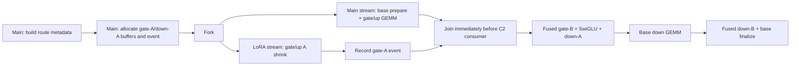

# BF16 C3 gate-A/base overlap checkpoint

This directory is the durable evidence bundle for the benchmark-only C3
execution prototype. C3 retains the complete C2 fused consumers and changes
only the producer schedule: gate/up LoRA-A shrink runs concurrently with base
prepare plus gate/up GEMM. Production dispatch is unchanged.

## Topology



All route tensors, destinations, and the event are created on the caller's
stream before the fork. The side-stream region launches only the gate/up A
shrink. Capture-time event objects are retained until graph teardown. Nsight
may number the capture and side streams differently across devices; the event
dependencies and concurrent intervals, rather than numeric stream IDs, define
the topology.

## Measurement contract

- Devices: NVIDIA H200 GPU 0 and NVIDIA GB300 GPU 1.
- Shape family: Qwen3.5-35B-A3B local BF16 MoE, `H=2048`, `I=512`, `E=256`,
  top-k 8.
- Anchors: `T=1/32/64/128/256/2048`; ranks 32/64/128; T=32 is repeated at all
  three ranks; a mixed 16-active/16-base-row case is included.
- Candidates: C0, forced-overlap C1, C2P, C2F, and C3 with identical tensors,
  route, base provider, and factors.
- Schedule: aligned fused C2 consumer, `BN=64`, 4 warps; fused finalizer
  `BH=32`, 4 warps; routed scaling factor 1.75.
- Base-row activation fill is selected by the admitted fixed-shape plan:
  `has_base_rows=false` passes no mapping to the optional fill on all-active
  captures, while mixed/base-row captures set it true and pay the fill. No
  device tensor is scanned during eager iterations or graph replay.
- Timing: eager and CUDA graph; 10 warmups, 30 CUDA-event samples, five rotated
  counterbalance orders. Percentages are paired within each order.
- Winner rule: all paired repeats must agree on sign, and the median effect
  must exceed both 1% and the paired-repeat percentage range. Smaller effects
  are reported as inconclusive.
- C1 policy controls separately run `production_auto` at T=256 and T=2048.
  The main matrix forces C1 overlap so topology, rather than the existing token
  threshold, is compared.

`matrix/*.json` contains all raw samples, capture checks, route hashes, CLI
arguments, and environment metadata. `summary.json` and `summary.md` are
generated by `benchmark/kernels/lora_moe/summarize_c3_overlap.py`.

## Correctness

The independent numerical oracle is production C0 minus matched DeepGEMM N0;
the large base output therefore cannot hide a lost LoRA delta. BF16 atomic
rank reductions are nondeterministic, so each candidate and C0 are run twice.
The tolerance is twice the sum of those measured repeat envelopes, capped at
25% of the LoRA signal. An all-zero/dropped delta consequently still fails by
at least 4x. Every matrix cell passed.

Additional checks passed on both GPUs:

- active and base-only rows in the same batch;
- base rows match N0 (H200 max error 0; GB300 max error `7.63e-6` in the
  dedicated mixed smoke, and all matrix checks pass);
- routed scaling factor 1.75 is applied once;
- eager-to-graph output agreement across three replays;
- captured C3 owns exactly one graph-scoped event resource, and that ownership
  is stable over replay;
- repeated C3 output stays within the measured atomic envelope.

Registered test command on each device:

```text
CUDA_VISIBLE_DEVICES=<assigned> PYTHONPATH=<repo>/python:<repo> \
  pytest -q test/registered/lora/test_sgl_lora_c3.py
```

Result: `2 passed` on H200 and `2 passed` on GB300. The two parameterized cases
cover both static contracts: all-active with the fill omitted and mixed rows
with the fill retained.

## Performance result

### Captured decode: overlap is useful through T=128

The table compares C3 to the serial complete C2F topology. Negative means C3
is faster. All listed results satisfy the conservative winner rule.

| T / R | H200 C2F -> C3 | H200 delta | GB300 C2F -> C3 | GB300 delta |
|---|---:|---:|---:|---:|
| 1 / 32 | 95.792 -> 90.320 us | -5.70% | 84.688 -> 78.784 us | -6.93% |
| 32 / 64 | 457.280 -> 445.056 us | -2.61% | 326.656 -> 316.928 us | -2.97% |
| 32 / 128 | 514.496 -> 500.736 us | -2.60% | 362.768 -> 348.928 us | -3.82% |
| 64 / 128 | 721.968 -> 707.904 us | -1.99% | 509.728 -> 496.384 us | -2.62% |
| 128 / 128 | 961.600 -> 950.768 us | -1.09% | 664.896 -> 650.896 us | -1.99% |

Mixed base/active rows retain the captured benefit: C3 versus C2F is -1.14%
on H200 and -3.38% on GB300 at T=32/R=64.

### T>=256: do not select complete C3

At T=256, C3 versus C2F is inconclusive on H200 (-0.82%) and narrowly faster
on GB300 (-1.03%), but C3 is still 4.0-6.7% slower than C0/C1/C2P under graph
replay. At T=2048, C3 is 56.6% slower than C2P on H200 and 63.4% slower on
GB300. The small C3-versus-C2F result there (-0.58%/-1.16%) does not make the
complete-fusion topology competitive with the better families.

Eager results are not portable enough for a C3 rule. H200 C3 beats C2F by
2.20% at T=64/R=128, while GB300 C3 is 9.20% slower at the same anchor. For
very small eager batches, C2F is generally faster than C3 because host launch
overhead and stream/event setup dominate.

### Existing C1 threshold control

- At T=256, production-auto enables C1 overlap. Its graph result is
  indistinguishable on H200 and 1.79% faster than C0 on GB300, while eager C1
  is 11-15% slower than C0.
- At T=2048, production-auto resolves C1 to serial. C0 and C1 agree within
  noise on both devices.

This supports keeping policy selection shape- and execution-mode-aware rather
than treating `T<=256` as a universal overlap win.

## Nsight evidence

No new kernel was introduced, so Nsight Compute was intentionally not run.
Nsight Systems was used to validate launch order and concurrency.

- Decode T=64/R=128 C3:
  - H200: 321.214 us of two-stream overlap across 10 replays (32.121 us per
    replay), covering 10.5% of the shorter stream's busy time.
  - GB300: 234.018 us across 10 replays (23.402 us per replay), covering 11.6%
    of the shorter stream.
  - The matched H200 C2F trace has one stream and no material kernel overlap.
- Prefill T=2048/R=64 C3:
  - H200: only 46.910 us across five replays (9.382 us/replay).
  - GB300: 186.017 us across five replays (37.203 us/replay).
  - The fused down finalizer consumes 670.73 us/replay on H200 and 553.19
    us/replay on GB300, 47.8% and 50.3% of traced kernel time respectively.
  - In the H200 C2P control, separate down expand plus post-reorder cost about
    127.50 + 21.12 us/replay. This is why C2P decisively wins prefill even
    though C3 successfully overlaps gate-A.

The trace kernel counts also prove the static selector is effective. Relative
to the charged preliminary trace, all-active decode dropped from 13 to 12
kernels per replay and prefill dropped from 18 to 17; the
`_base_only_swiglu_activation_kernel` is absent from every final all-active
C2P/C2F/C3 trace. Mixed-row correctness artifacts retain `has_base_rows=true`.

GB300 node-granularity profiling of the serial C2F/C2P controls was attempted,
but the profiled processes remained in CPU JIT before the capture range; both
were stopped after producing no trace. The paired H200 serial traces and both
GB300 C3 traces are present, and all unprofiled GB300 timing results are valid.

## Decision

1. Keep C3 benchmark-only for now; do not change serving dispatch.
2. C3 is a viable CUDA-graph decode candidate for `T<=128`, pending broader
   model/provider validation and a real selector.
3. Do not select complete C3 at T>=256 or for prefill. Use C2P/C0/C1 until the
   down finalizer has a size-aware fallback or a scalable implementation.
4. Do not adopt a general eager C3 rule from this checkpoint; H200 and GB300
   disagree at important anchors.

## Artifact map and provenance

- `h200/matrix`, `gb300/matrix`: full counterbalanced raw timing/correctness.
- `*/policy`: production-auto C1 threshold controls.
- `*/smoke`, `*/mixed`: early smoke and dedicated mixed-row graph checks.
- `*/nsys/*.nsys-rep`: Nsight Systems reports.
- `*/nsys/*.sqlite`: exported trace databases.
- `*/nsys/*overlap.json`: stream overlap analysis generated by
  `benchmark/kernels/lora_moe/analyze_c3_nsys.py`.
- `*/nsys/*cuda_gpu_kern_sum.csv`: per-kernel trace summaries.
- `*/source_sha256.txt`: exact source hashes for the full matrix and Nsight
  snapshot.

The remote trees were updated by explicit file sync, so their embedded Git
revision (`4ffaee0b...`, dirty) is not the true source identity. The H200 and
GB300 manifests are identical and match the focused local files. Use the
manifests, not the embedded remote Git revision, for exact reproduction.
