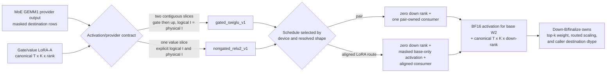

# Cross-model C2 semantic/provider guardrails

This directory records a benchmark-only extension of the SGL LoRA C2 consumer
boundary beyond Qwen. Production dispatch is unchanged. The goal is to prove
which parts of the ABI generalize across models, identify provider-specific
specializations explicitly, and measure the pair-owned and virtual-expert
aligned schedules under the same correctness contract.

## Architecture and contracts

The semantic contract is keyed by activation, logical slices, targeted slices,
provider slice order, logical/physical intermediate widths, and provider row
domain. A model preset only resolves dimensions. Consequently:

- Qwen 3.5 397B, Kimi K2.5, and GLM 5.2 share `gated_swiglu_v1` because all
  expose the same contiguous `gate | up` provider contract.
- Nemotron 3 Super and Nano share a separate `nongated_relu2_v1` kernel. It
  has one value slice and no dead gate accumulator or runtime activation branch.
- Nano (`logical I=1856`, `physical I=1920`) and the synthetic odd-I guardrail
  (`logical I=1877`, `physical I=1920`) prove that padding is explicit, is
  written as zero at valid destinations, and never contributes to ReLU2 or
  down-A.
- Arbitrary partial targeting (`gate` only, `up` only, or neither) and provider
  slice reordering are represented without materialized zero LoRA factors by
  the oracle contract. They deliberately remain specialization-required rather
  than silently entering the narrow fast kernels.

The aligned route contains only LoRA-active virtual experts. Base-only rows
therefore require a charged masked activation prepass. The benchmark includes
that launch; it does not compare an incomplete aligned topology against the
pair path. Both aligned consumers also check global expert IDs against the
explicit local EP interval before reading provider-private `src2dst` metadata.

## Matrix and correctness gates

Each GPU runs 276 process-isolated CUDA-graph configurations:

- five real model presets x `T={1,32,256}` x `R={16,32,64}` x
  `{pair,aligned}` x `BN={16,32,64}` = 270 configurations;
- one focused odd-I/padded-provider case at `T=32, R=32` x two schedules x
  three `BN` values = 6 configurations.

The fixed guardrail route uses two loaded adapter slots, alternates active
slots by token, makes every fifth token after token zero base-only, injects a
negative invalid expert sentinel every seventh token, uses global IDs with
local offset 11, and permutes provider destinations non-densely. Aligned
packing uses `BM=16`; only `BN` is swept here. This is a repeatable ABI stress
route, not a routing-distribution study.

The resolved C2 dimensions are:

| Preset | Activation | Logical/physical I | Experts | top-k |
|---|---|---:|---:|---:|
| Qwen 3.5 397B-A17B | SwiGLU | 1024 / 1024 | 512 | 10 |
| Kimi K2.5 | SwiGLU | 2048 / 2048 | 384 | 8 |
| GLM 5.2 | SwiGLU | 2048 / 2048 | 256 | 8 |
| Nemotron 3 Super | ReLU2 | 2688 / 2688 | 512 | 22 |
| Nemotron 3 Nano | ReLU2 | 1856 / 1920 | 128 | 6 |
| Odd provider guardrail | ReLU2 | 1877 / 1920 | 17 | 5 |

`H_model` is intentionally not consumed here: this is the C2 boundary after
gate/value LoRA-A and GEMM1. The exact `I`, expert count, top-k, token count,
rank, route occupancy, and provider layout are the dimensions that reach this
consumer.

Every configuration runs in a fresh process and retains JSON, stdout/stderr,
and exit status. It checks CUDA-graph replay bitwise for activation and within
the BF16 atomic tolerance for down rank. A signal-relative PyTorch oracle
samples active-LoRA, base-only, invalid-ID, first/middle/last route categories;
the registered GPU tests additionally compare complete small tensors. CPU
oracles cover partial slices and reordered providers. Routed scaling `1.75`
and BF16/FP32 destination selection are owned and checked at down-B/finalize,
not folded into C2. In this bundle that is a reference-contract check, not a
claim that the active experimental runner already handles non-unit scaling;
production-path scaling remains a separate correctness blocker.

## Results

All **552/552** isolated configurations passed: 276 on H200 and 276 on
GB300, resolving 46 shape cells per device. CUDA-graph replay passed in every
configuration. Activation matched exactly; the largest BF16 down-rank error
was `0.0002288818` on H200 (3.19% of signal) and `0.0001525879` on GB300
(3.77% of signal), inside the explicit 5% gate. The final registered suite
passed 13/13 cases on each GPU, including gated R128 compile/correctness,
positive global IDs outside the local EP shard, base-only rows omitted from
the aligned route, and padded ReLU2 shapes. The CPU semantic suite passed 7/7.

| Device | Pair selected | Aligned selected | T1 aligned/pair | T32 aligned/pair | T256 aligned/pair | BN64 selected |
|---|---:|---:|---:|---:|---:|---:|
| H200 | 13 | 33 | 15 / 0 | 5 / 10 | 12 / 3 | 38 / 46 |
| GB300 | 12 | 34 | 15 / 0 | 6 / 9 | 12 / 3 | 39 / 46 |

| Kernel/model contract | H200 aligned/pair | GB300 aligned/pair |
|---|---:|---:|
| Qwen 3.5 397B, gated SwiGLU | 5 / 4 | 6 / 3 |
| Kimi K2.5, gated SwiGLU | 6 / 3 | 6 / 3 |
| GLM 5.2, gated SwiGLU | 6 / 3 | 6 / 3 |
| Nemotron 3 Super, ReLU2 | 6 / 3 | 6 / 3 |
| Nemotron 3 Nano, padded ReLU2 | 9 / 0 | 9 / 0 |
| Odd-I padded ReLU2 guardrail | 1 / 0 | 1 / 0 |

There is no defensible universal pair/aligned rule. Aligned won every T1
cell even with its charged masked prepass; T32 favored pair overall; T256
favored aligned except the gated R16 cells for Qwen/Kimi/GLM. Every selected
T32/T256 configuration used `BN=64`; smaller selected tiles occurred only at
T1. The only cross-architecture schedule flip was Qwen T32/R32: H200 selected
pair, while GB300 selected aligned by just 0.36%. This is the expected design
boundary: the kernel family is provider-contract keyed, while schedule/tile
selection is device, resolved shape, and route-occupancy keyed. Near ties
must not be hardened into a token-count threshold.

The final mixed-row Qwen local-MoE regression exercises the actual
experimental-C2 caller with the base-only prepass under CUDA graphs:

| Device | C2P aligned vs C0, paired median | Delta max error | Error/signal |
|---|---:|---:|---:|
| H200 | -1.20% | 0.0001831055 | 5.16% |
| GB300 | -0.93% | 0.0001831055 | 5.45% |

Negative latency deltas favor C2P. These two full-pipeline checks establish
that omitting base-only rows from the LoRA-aligned route no longer leaves the
base activation buffer unwritten; they do not claim that this partial C2 path
is the final fused-down production design.

## Artifact map

- `h200/final_summary.{json,md}` and `gb300/final_summary.{json,md}` contain
  every resolved shape selection and correctness maxima.
- `h200/results-gpu{4,6}/` and `gb300/results-gpu2/` retain one JSON, log, and
  status file per schedule/tile configuration.
- `*/pytest_c2_contracts.xml` records the final combined registered gated and
  ReLU2 kernel suite on each architecture.
- `h200/m0_aligned_mixed.json` is the full local-MoE mixed-row regression for
  the production experimental-C2 caller after adding the base-only prepass;
  the GB300 counterpart is retained under `gb300/`.
- `SOURCE_PROVENANCE.md` binds both remote working trees by content hash.
- `SHA256SUMS` covers every retained file in this directory except itself.

Before generating the local manifest, every H200 raw result file and every
GB300 raw result file was compared by SHA-256 against its source node; all
copies matched.

The raw timings select only among the tested Triton pair/aligned schedules and
tile widths for this benchmark-only C2 boundary. They do not establish a
production dispatch policy, include communications, or replace later
end-to-end/provider-specific validation. The Kimi/GLM presets reproduce routed
expert dimensions only; fused shared-expert IDs and shared-expert computation
are outside this matrix and must pass their dedicated correctness gate before
those model families enter an end-to-end run. Routes are labeled accurately as
a deterministic lattice with invalid-ID guardrails, not IID; schedule choices
remain guardrail observations until repeated across true-IID seeds and skew.
