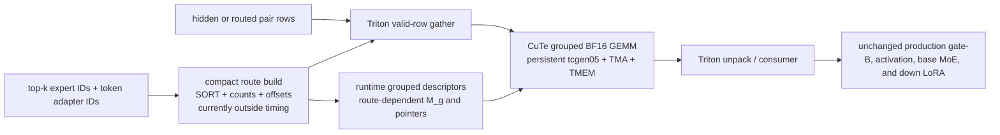
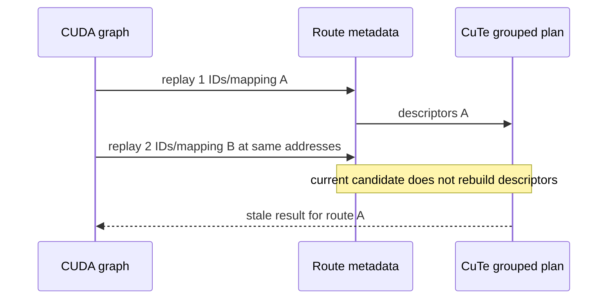

# Blackwell Python CuTe DSL MoE-LoRA audit

## Decision

Do not integrate this CuTe provider into production.

The implementation is a real Blackwell persistent grouped GEMM using `tcgen05`, TMA, TMEM, and warp specialization—not a scalar CuTe probe. It finds one useful upper bound: on GB300, the exact T=2048/rank-128 multi-adapter IID gate-A boundary is 16.4% lower latency than the independently tuned Triton control under CUDA graph timing. Replacing only gate-A inside the full C0 MoE pipeline reduces the measured static-route M0 latency by 6.0%.

That result is not dispatch eligible. The CuTe plan bakes one route's sorted pair order, nonempty groups, group offsets, per-group M sizes, and pointers into graph-stable descriptors. Serving reuses addresses while expert IDs and adapter assignments change. The route-mutation test changes both inputs in place, but the captured CuTe replay output does not change at all and is wrong by 0.3286 max absolute error. Building the current route plan every forward costs 13–23 ms, requires a host synchronization, and cannot be captured. A dynamic GPU route/descriptor design is therefore a prerequisite, not a follow-up optimization.

No production serving file imports this provider. All implementation and M0 substitution code is benchmark-only.

## Architecture evaluated



The serving requirement differs at the first edge:



The CuTe gate-A boundary contains three launches:

1. gather valid token rows into compact group order;
2. one persistent grouped Tensor Core GEMM over all nonempty virtual groups;
3. unpack compact rows into canonical token/top-k order and zero invalid rows.

The fused C2 candidate uses two grouped GEMMs around activation: gate-B, activation, then down-A. The down-finalize candidate keeps down-B packed and performs a token-owned weighted finalize. Those wider boundaries lost to Triton and were not advanced.

## Implementation map

| File | Purpose |
|---|---|
| `benchmark/kernels/lora_moe/cutedsl_grouped_tensorcore.py` | Validated adapter around FlashInfer's bundled NVIDIA `CuTeDSL/blackwell/grouped_gemm.py`; owns compile cache, runtime GPU shape/stride/pointer tensors, tactic selection, and graph replay. |
| `benchmark/kernels/lora_moe/cutedsl_moe_boundary.py` | Compact route, gather/unpack/scatter kernels, gate/down A boundary, fused gate-B+activation+down-A boundary, and packed down-B finalize boundary. |
| `benchmark/kernels/lora_moe/bench_cutedsl_tensorcore.py` | Qwen-like core matrix and CuTe tactic sweeps against Triton indexed, segmented, and aligned families. |
| `benchmark/kernels/lora_moe/bench_cutedsl_cross_model.py` | Wide SwiGLU and odd logical/physical-width ReLU2 semantic contract comparison. |
| `benchmark/kernels/lora_moe/bench_cutedsl_shortlist.py` | Final interleaved hot/cold shortlist, dynamic-route replay audit, and Nsight Compute entry point. |
| `benchmark/kernels/lora_moe/bench_moe_pipeline.py` | Benchmark-only `cutedsl_static_gate` M0 upper-bound injection; only gate-A changes. |
| `benchmark/kernels/lora_moe/matrix.py` | Adds the exact T=2048/rank-128 M0 case. |

The source adapter validates this exact bundled implementation:

- CuTe Python package: 4.6.0
- source SHA-256: `05b74a05682c024557d83284e32f973ed5be4f0d1a1a12c72fe7824c29f7e94f`
- compiler/runtime: CUDA 13.0, PyTorch 2.11.0+cu130
- test GPU: NVIDIA GB300, SM103

First compilation was about 1.5–1.9 seconds depending on the variant. Plans then reuse the Python compile cache for the same group count and tactic. Because group count is currently compile-time and the number of nonempty virtual groups can change with routing, a serving implementation would also need to control variant proliferation.

## Coverage

The core matrix contains 384 successful runs and zero errors:

- sites: gate-A, down-A, gate-B+activation+down-A, and down-B+finalize;
- token counts: 1, 32, and 2048;
- ranks: 16, 32, 64, and 128;
- Qwen-like local dimensions: H=2048, I=512, E=32, top-k=8;
- four active adapters with multi-adapter IID routing;
- implementations: Triton indexed, segmented, aligned, and CuTe grouped Tensor Core;
- eager and CUDA graph execution;
- full conversion/consumer boundary, not just GEMM compute.

The tactic sweeps add 136 successful runs and zero errors. They cover M/N tiles, one-CTA versus two-CTA MMA, SMEM versus GMEM tensor-map update, compute-only versus honest boundary timing, and T=32/256/2048. CuTe's T=2048 gate-A winner is `mma_m=128`, `mma_n=128`, cluster 1x1, one-CTA, SMEM tensor-map update.

The final Triton control was tuned independently over BN, BK, and warp count. For the exact multi/IID route its winner is aligned BN128/BK64/4 warps.

Cross-model guardrails cover:

- Kimi K2.5: H=7168, I=2048, E=384, top-k=8, T=32, rank=64, SwiGLU;
- odd non-gated case: logical I=1877, physical I=1920, top-k=5, T=32, rank=32, ReLU2;
- global-to-local expert offsets, invalid expert rows, base-only rows, provider destinations, and logical padding;
- eager and CUDA graph replay correctness.

The exact M0 case is larger than the EP-local K0 shortlist: Qwen3.5-35B, T=2048, H=2048, I=512, E=256, top-k=8, rank=128, four active adapters, uniform IID top-k without replacement. It produces 1024 nonempty virtual groups with 5–31 rows per group.

## Results

### Exact gate-A K0 shortlist

The values below are medians across the two measurement orders where applicable.

| Execution/cache | CuTe m128n128 | Triton aligned BN128/BK64/w4 | CuTe latency change |
|---|---:|---:|---:|
| CUDA graph, hot | 73.152 us | 87.520 us | -16.42% |
| CUDA graph, cold | 73.968 us | 89.224 us | -17.10% |
| Eager, cold | 76.992 us | 91.296 us | -15.67% |

Eager/hot CuTe had an order-sensitive outlier: 77.200 us in forward order and 99.248 us in reverse order. CUDA graph and cold-cache controls are stable. This is why the conclusion uses the graph result and does not claim a robust eager/hot win.

The first Triton sweep with filenames `triton_gate_a_*.json` is not comparable: it used mixed adapters and a regular route with only 32 active groups. It is retained as rejected-experiment evidence. Only `triton_iid_gate_a_*.json` uses the matched four-adapter IID route with 128 active groups and all 16,384 pairs valid.

### Full M0 static-route upper bound

Two separate processes were run in each direction of the provider order. Each result includes the full production base MoE, gate-B, activation, and down LoRA. Only gate-A is substituted. Production B routing remains inside M0; the candidate's static gate-A route build is outside M0.

| Execution | Static-route CuTe gate-A | Production C0 | CuTe latency change |
|---|---:|---:|---:|
| CUDA graph | 996.032 us | 1059.312 us | -5.97% |
| Eager | 1071.816 us | 1105.600 us | -3.06% |

The full output agrees with production to 0.000244 max absolute error. Eager-to-graph replay has the same maximum error. These checks prove arithmetic parity for the one captured route; they do not prove route dynamism.

This M0 result is an upper bound, not an admissible provider comparison, because it removes gate-A route construction from the timed candidate. The current route build takes about 13.5 ms for the M0 route and uses a host-visible counts list. Charging that implementation per forward would overwhelm the 63 us graph saving and would prevent graph capture.

### Broad negative results

Outside gate-A T=2048/rank-128, CuTe lost almost everywhere. In the 96 core site/shape/execution cells, it beat the best baseline in only three pre-final-tuning cells. The independently tuned final shortlist reduced that to one useful niche.

Representative CUDA graph boundaries:

| Case | CuTe | Best Triton | Result |
|---|---:|---:|---:|
| Qwen-like T32/R64 gate-B+act+down-A | 46.560 us | 13.600 us | CuTe 3.4x latency |
| Qwen-like T32/R64 down-B+finalize | 54.800 us | 15.024 us | CuTe 3.6x latency |
| Qwen-like T2048/R128 gate-B+act+down-A | 183.776 us | 97.760 us | CuTe 1.9x latency |
| Qwen-like T2048/R128 down-B+finalize | 183.712 us | 153.024 us | CuTe 20.1% slower |
| Kimi K2.5 T32/R64 fused C2 | 189.904 us | 42.416 us | CuTe 4.5x latency |
| Odd ReLU2 I1877p1920 T32/R32 fused C2 | 36.288 us | 14.688 us | CuTe 2.5x latency |

Compute-only CuTe numbers are reported as diagnostic upper bounds but never used for dispatch decisions because gather, unpack, activation, and finalization are mandatory.

## Dynamic route replay audit

The audit captures the CuTe boundary, then changes expert IDs and adapter IDs in place while preserving tensor addresses.

| Metric | Value |
|---|---:|
| Correct reference change after route mutation | 0.328613 max abs |
| Captured CuTe output change | 0.0 |
| Captured CuTe error versus mutated reference | 0.328613 max abs |
| Original-route replay error | 0.000977 max abs |

This is a hard semantic failure, not a performance concern. A future CuTe candidate must rebuild route order, counts, offsets, problem shapes, and pointers on GPU within the measured/captured boundary, then repeat correctness with route values mutated between replays.

## Nsight Compute

Both shortlisted boundaries were captured with `--set basic` and NVTX ranges. The reports confirm the intended launch topology.

| Provider kernel | Instrumented duration | Compute/memory throughput | DRAM throughput | SM throughput |
|---|---:|---:|---:|---:|
| CuTe gather | 25.120 us | 50.74% | 8.17% | 29.93% |
| CuTe grouped tcgen05 GEMM | 50.528 us | 52.51% | 52.51% | 36.28% |
| CuTe unpack | 7.968 us | 19.40% | 13.51% | 11.42% |
| Triton output fill | 6.528 us | 18.74% | 0.01% | 8.28% |
| Triton aligned shrink | 128.288 us | 67.78% | 14.77% | 36.69% |

Nsight Compute replays kernels for metric collection, so these absolute durations must not replace the event-timed shortlist. Use them to inspect launch composition and bottlenecks. The `.ncu-rep` files are included for third-party inspection.

## H200 status

The reserved H200 reports SM90, but its environment does not contain the Python `cutlass`/CuTe DSL compiler. More importantly, this candidate adapts a Blackwell `tcgen05` grouped kernel and has no SM90 implementation. The H200 arm is therefore explicitly `not_run`, rather than comparing Triton against a different or scalar fallback. A future Hopper comparison needs a genuine SM90 WGMMA/TMA CuTe implementation and the same semantic boundaries.

## Artifact index

- `summary.json`: compact decision and headline numbers.
- `raw/core_qwen.json`: 384-run core matrix.
- `raw/tune_qwen.json`: T32/T256 CuTe tactic matrix.
- `raw/tune_gate_a_prefill.json`: T2048/R64/R128 CuTe tactic matrix.
- `raw/final_shortlist.json`: full eager/graph, hot/cold, forward/reverse shortlist.
- `raw/triton_iid_gate_a_*.json`: matched Triton schedule sweep.
- `raw/triton_gate_a_*.json`: rejected regular/mixed-route sweep; do not compare to the IID CuTe case.
- `raw/cross_kimi.json`: wide SwiGLU cross-model boundary.
- `raw/cross_odd_relu2.json`: odd-width non-gated ReLU2 boundary.
- `raw/m0/*.json`: two production and two static-route CuTe processes per execution mode.
- `raw/route_mutation.json`: dynamic graph-replay failure evidence.
- `raw/cutedsl_shortlist_ncu.ncu-rep` and `raw/triton_shortlist_ncu.ncu-rep`: profiler reports.
- `raw/*_ncu.csv`: readable raw profiler exports.
- `raw/h200_capability.json`: SM90 environment capability result.
- `SHA256SUMS`: integrity hashes for every retained artifact except itself.

## Reproduction commands

All commands use physical GB300 GPU0.

```bash
CUDA_VISIBLE_DEVICES=0 PYTHONPATH=python python \
  benchmark/kernels/lora_moe/bench_cutedsl_tensorcore.py \
  --tokens 1,32,2048 --ranks 16,32,64,128 \
  --sites gate_a,down_a,gate_consumer,down_finalize \
  --families indexed,segmented,aligned \
  --executions eager,cuda_graph --scopes boundary

CUDA_VISIBLE_DEVICES=0 PYTHONPATH=python python \
  benchmark/kernels/lora_moe/bench_cutedsl_shortlist.py \
  --executions eager,cuda_graph --cache-states hot,cold \
  --warmup 10 --samples 50 --json-output final_shortlist.json

CUDA_VISIBLE_DEVICES=0 PYTHONPATH=python python \
  benchmark/kernels/lora_moe/bench_moe_pipeline.py \
  --device gb300 \
  --case-id p0-qwen3.5-35b-a3b-prefill-r128-gb300 \
  --pipeline C0 --route-pattern uniform_iid_without_replacement \
  --route-seed 0 --a-provider cutedsl_static_gate \
  --execution cuda_graph --cache-state hot --warmup 10 --samples 40

CUDA_VISIBLE_DEVICES=0 PYTHONPATH=python ncu \
  --target-processes all --set basic --nvtx \
  --nvtx-include cutedsl_shortlist/ \
  --export cutedsl_shortlist_ncu --force-overwrite \
  python benchmark/kernels/lora_moe/bench_cutedsl_shortlist.py \
  --profile cutedsl --profile-iterations 1
```

## What a future CuTe attempt must change

1. Generate compact route order, inverse map, group offsets, and problem descriptors entirely on GPU.
2. Keep descriptor capacity static while allowing counts and active groups to change during graph replay.
3. Include this work in K0/O0/M0 timing and mutate routes between graph replays for correctness.
4. Re-evaluate gate-A T=2048/rank-128; do not spend more time on the currently dominated fused C2/down-finalize designs without a new fusion mechanism.
5. Add a separate real SM90 WGMMA/TMA kernel before claiming Hopper coverage.

Until those conditions are met, the production strategy remains the tuned Triton routed/segmented/aligned families. The CuTe result is useful evidence that a dynamic Tensor Core grouped gate-A path may be worthwhile at large rank/prefill, but the present static descriptor design is not a backend candidate.
