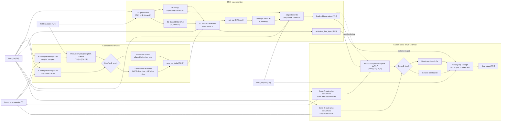
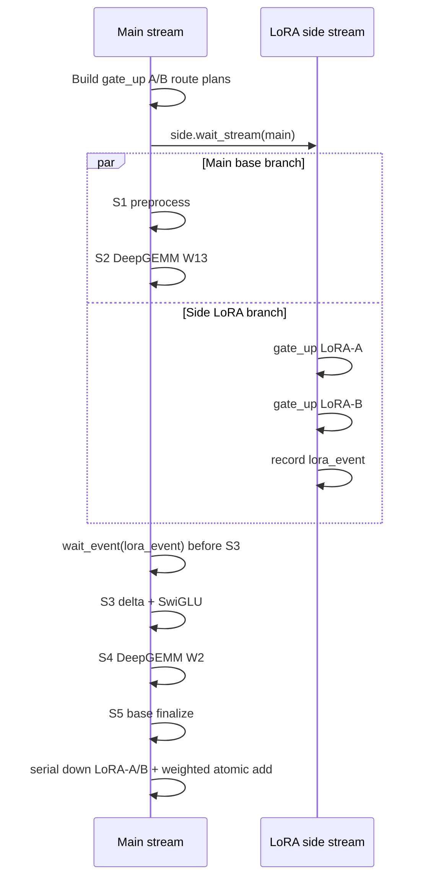
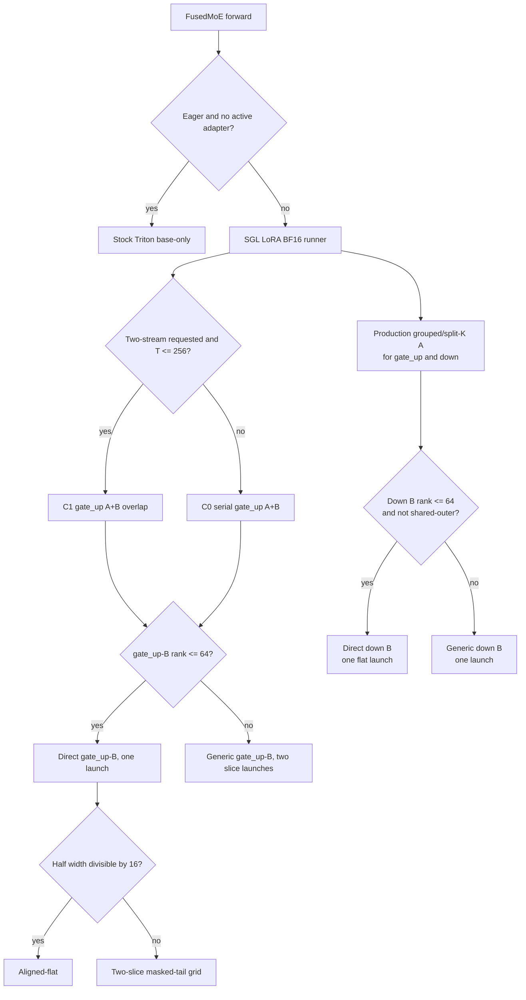
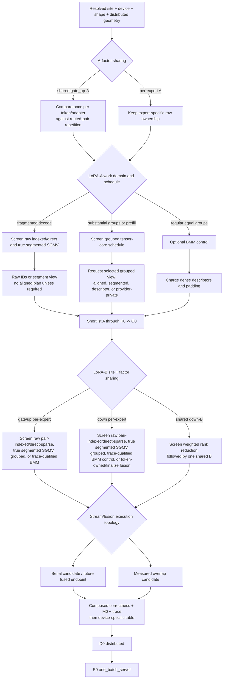
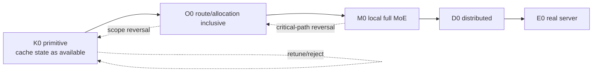

# SGL LoRA MoE kernel benchmark, architecture, and decision audit

Evidence snapshot: 2026-07-22 final campaign  
Design-review update: 2026-07-22 (review incorporated into code, evidence, and conclusions)  
Active branch: `sgl-lora`  
Final rebased campaign head: `f2f406e056`  
Historical pre-review benchmark point: `4ffaee0b413fae1098054a0c98eeae02ab537c02`  
Archived pre-redesign branch: `sgl-lora-pre-redesign-backup-20260721` at `72055b46fd`

This document is the audit-oriented answer to four questions:

1. What cases, kernels, variants, layouts, execution modes, and optimizations have
   actually been tested?
2. What conclusions can be drawn, and where should each implementation currently be
   preferred?
3. How was comparison fairness and implementation quality checked?
4. What is the current MoE-LoRA execution architecture?

The most important distinction throughout the preserved evidence trail is:

- **historical active snapshot**: source present at `4ffaee0b41` when the audit
  began;
- **final implementation**: the rebased branch and focused follow-up commits named
  in section 0; the final review-disposition ledger is bundled and resolved;
- **executed evidence**: a checked GPU run with retained results;
- **archived evidence**: useful measurements from `72055b46fd`, whose generalized
  kernels are intentionally not present on the active branch;
- **planned**: represented in the design matrix but not implemented or executed.

Defined benchmark records, compile success, unit correctness, isolated kernel timing,
local full-MoE timing, distributed timing, and server timing are different evidence
levels. This report does not treat one as proof of another.

## 0. Final campaign addendum

Sections 1–15 and the explicitly labeled historical subsections in 16–18 preserve
the detailed pre-review campaign and its reasoning trail. Whenever an older sentence
says that C2/C3, rank graduation, quants, D0, E0, shared-outer, or physical shared IDs
are still wholly planned, this addendum and the retained evidence supersede that
status statement. The promoted physical-shared scope is intentionally narrow:
Standard contiguous/EP1 or another layout that provably does not remap physical
shared IDs per rank. Per-rank physical shared EP>1 and advanced A2A remain
unpromoted. Historical timings remain historical; they are not rewritten to look
like production results.

### 0.1 What completed

| Scope | Final evidence |
|---|---|
| Methodology repair | Signal-relative delta oracles, true-IID/skewed routes, marginal route-cost accounting, forced-cold and loaded-host controls, counterbalanced order, explicit PDL-off, per-order dispersion, and durable manifests. |
| BF16 P1–P3 | Production C2/C3 planner, fused down finalize, legal R8/R16/R128 schedules, activation/provider contracts, cross-model Qwen/Kimi/GLM/Nemotron shapes, and separate base/adapter graphs. |
| E0 | Real Qwen1.5-MoE plus adapter through `sglang.benchmark.one_batch_server`, including base, adapter, and mixed requests. |
| D0 | Real H200 TP/EP/MoE-DP collectives plus two-node GB300 TP8/EP2/DP2 MNNVL; full H200 TP4/EP4 server smoke. |
| Lifecycle | Load, unload, eviction, slot reuse, same-name reload, base↔adapter graph transition, and same-assignment mixed replay on both devices. |
| Providers | Provider-neutral C0 seams were exercised without claiming broad checkpoint/server attachment. A no-LoRA invocation uses the resident quant method. Active FP8 rejects static activation, and Blackwell requires resident packed UE8M0 scales. Marlin W4A16 is attachable; its per-call workspace/dirty-destination repair passed the terminal `f2f406e056` H200 and GB300 smoke. Native CuTe DSL NVFP4 W4A4 remains synthetic/testbed-only and is not serving-reachable. LoRA/bridge tensors remain BF16 and materialized; provider-native fused LoRA is not graduated. |
| Shared work | The exact evidence-bounded shared-outer selector is promoted. Its host policy passed 9 tests; the combined shared-outer, physical-ID, and PDL suite passed 56 tests plus 10 subtests on each of H200 and GB300. This includes the TorchNative merged-segment-bound repair, bounded physical shared-ID composition, and producer/consumer PDL pairing. Per-rank physical shared EP>1 and advanced A2A remain unpromoted. |
| Technology study | Tuned Triton algorithm families plus an evidence-only Blackwell CuTe DSL tensor-core/TMA K0 candidate: 73.152 us versus Triton 87.520 us (-16.42%). Static M0 is invalid under route mutation, so no production integration is claimed. |
| Reproducibility | Per-lane campaign evidence, Nsight reports, raw logs, source hashes, manifests, SHA-256 files, the final root manifest, and the finding-by-finding disposition ledger live under `benchmark_results/sgl_lora_moe_20260722/`. |

The terminal suite also ran a deliberately broader, non-LoRA per-token FP8
JIT-versus-AOT diagnostic. H200 passed it; GB300 exposed 66 bit-exact mismatches in
the pre-existing unmasked path. A representative case failed identically with the
official-main AOT source, while every branch-added masked-layout and LoRA
provider-plan case passed. The control is retained under `final_validation/` and is
classified as a later general quant-kernel issue, not a LoRA acceptance failure.

### 0.2 Final architecture decision

~~~mermaid
flowchart LR
    S["Standard dispatcher<br/>global→local IDs + packed top-k"] --> P["Host execution plan<br/>provider/phase/graph/rank/rows"]
    P --> N0["N0 base-only graph"]
    P --> C0["C0 provider-neutral serial"]
    P --> C2["C2 BF16 fused consumer/finalize"]
    P --> C3["C3 gate-A-only overlap"]
    C0 --> V["Virtual-expert LoRA A/B<br/>factor-domain masking"]
    C2 --> V
    C3 --> V
    V --> B["Provider-private base stages<br/>BF16 / FP8 / NVFP4 / Marlin"]
    B --> F["Finalize / combine / collective"]
~~~

There is no universal “grouped GEMM versus SGMV” answer. The semantic API is one
LoRA A/B pipeline; the immutable host plan selects raw indexed, aligned/grouped,
slice-aware, shared-factor, or fused-consumer schedules only in their measured
domain. Decode/prefill phase, eager/graph mode, provider, device generation, logical
and physical rank, expert fragmentation, activation/layout, sharedness, and output
ownership are legitimate static keys. Close cells and unsupported contracts retain
the established C0 or legacy path.

### 0.3 Final performance interpretation

- The promoted BF16 planner materially lowers the local LoRA tail and preserves the
  intended C3 two-stream dependency graph, but it does **not** establish universal
  superiority over experimental TRTLLM.
- In the matched GB300 model-level bracket, SGL base traffic is near parity. The
  historical pre-planner path was 12.56%–14.71% behind experimental TRTLLM; final
  default C2 is 9.43%, 9.44%, and 10.39% behind, while opt-in C3 is 5.12%, 5.54%, and 10.48% behind at
  BS1/16/32. This remains the next launch/fusion target.
- The serial-prefill C0 tax at `T=2048` is +71.6% on H200 and +82.6% on GB300,
  so decode wins do not justify a universal indexed schedule.
- The all-base sentinel retains 100.53% of N0 on H200 and 100.72% on GB300; both
  are within a 1% noise/parity band and are not claimed as speedups.
- Packed physical-rank execution is clearly better than padded-Rmax execution for
  lower-rank active adapters (roughly 10%–57% in the measured local cells), but the
  current static policy evidence is not a claim that serving residency already owns
  stable multi-rank buckets.
- One-GPU local-shape tests are never reported as communication evidence. The D0
  conclusions come only from actual multi-rank collectives; the two-node job was
  cancelled after artifacts were copied.

### 0.4 Remaining product work, not hidden benchmark gaps

The MoE kernel/execution campaign does not complete Phase 2 dense/special layers or
Phase 3 adapter control plane. Stable mixed-rank residency, immutable adapter
identity and leases, advanced A2A, broader checkpoint-level quant E0, and MTP/EAGLE
remain explicit later work. These do not invalidate the completed local provider,
distributed, graph, lifecycle, and methodology evidence above.

---

## 1. Historical executive answer at `4ffaee0b41`

The current decision-grade campaign is deliberately narrow:

- BF16 only;
- H200 and GB300;
- physical WS1 execution with the full local `TP=1`, `EP=1`, `MoE-DP=1`
  geometry; no one-GPU TP/EP/MoE-DP local-shape proxy was executed yet;
- gated SwiGLU;
- Qwen3.5-35B-A3B local geometry:
  `H=2048, I=512, E=256, K=8`;
- synthetic fixed local token shapes, not real server requests;
- executed model-scale performance ranks 32, 64, and 128; rank 16 appears in
  synthetic smoke, focused correctness, and archived isolated studies, but remains
  deferred model-scale coverage rather than an intentionally excluded rank;
- selected eager timing/correctness and full local-M0 CUDA-graph replay;
- primitive `K0`, route/allocation-inclusive `O0`, and local full-MoE `M0`;
- selected Nsight Systems traces and Nsight Compute counter runs.

The current evidence-guided strategy is:

| Stage | Current evidence-guided choice | Qualification |
|---|---|---|
| gate_up/down LoRA-A, fragmented decode | The tested raw-route indexed A is the leading benchmark candidate when route fragmentation and planning cost dominate. | Its 55.5%–71.9% O0 saving is an operator-isolated A-side result and is not pipeline-realizable while B still consumes the shared aligned plan. It is a handwritten Triton vector-reduction kernel, only **SGMV-like**, not a production SGMV library. It remains benchmark-only. Tiny gate_up-A can be slower in isolation but hidden by overlap. |
| gate_up/down LoRA-A, substantial prefill | Keep routed/grouped tensor-core A for the current path. | At `T=2048`, the tested Triton indexed A is catastrophically slower. This rejects that implementation at the anchor, not every future raw-indexed CuTe/CUDA schedule. |
| Gate/up LoRA-B, H200, tested R128 anchors | Direct B won the bounded T32 and T256 screens. | This is not a universal selector. Current production still selects direct only through rank 64. |
| Gate/up LoRA-B, GB300, R128 | Direct won T32; generic won T256 in full graph M0. | The T256 result reverses from O0 to M0: one direct launch is slower than two generic launches on device. |
| Down LoRA-B, H200, tested R128 anchors | Direct B won T32 and T256. | The T256 critical-path saving mainly comes from the serial down tail. |
| Down LoRA-B, GB300, tested R128 anchors | Tuned generic B won. | Both T32 and T256 composite candidates retained generic down. |
| Direct gate/up layout | Active Qwen M0 uses aligned-flat because each 512-column half is tileable. | The active M0 campaign does **not** exercise the odd-width two-slice fallback. |
| Odd or narrow gate/up slices | Keep an independent slice grid for correctness; archived evidence says a compiled uniform-sliced schedule can also be faster when flat is forced to a small BN. | The generalized uniform/ragged planner is archived, not current production source. |
| Serial versus two-stream | Preserve the current `T <= 256` compatibility policy for now. | Measurements show no performance cliff at 256. The long-term planner must use phase/device/graph/critical-path evidence, not a scalar token threshold. |
| Down execution | Current path is serial. | The most important next endpoint is down-B plus finalize/collective; no down-overlap policy has graduated. |
| Fused gate_up-B/activation/quant/down-A | Planned high-priority endpoint. | No fused competitor has been implemented or benchmarked on the active branch. |

These are “best within the screened implementation and configuration neighborhood,”
not global-optimum claims. Production dispatch is intentionally unchanged by the
benchmark-only winners.

### 1.1 Design-review corrections that constrain every conclusion

The 2026-07-22 review established the following without adding benchmark evidence:

1. A single GPU can simulate the exact local tensor geometry of one TP/EP/MoE-DP
   rank. Such a run must be labeled, for example, `TP4 local-shape proxy`, never
   `TP4 performance`. It cannot establish collectives, A2A, rank imbalance,
   multi-rank graph safety, or communication overlap.
2. Rank 16 is required future model-scale coverage. Its absence from the active P0
   reports was matrix prioritization, not a claim that R32 represents it.
3. Model shared experts are a later, separate execution optimization. Shared-outer
   LoRA is different and must enter the early routed-MoE kernel matrix because the
   active implementation repeats shared gate/up A across top-k and falls back to
   generic shared down B.
4. The current route-plan nodes describe the active grouped/direct implementation,
   not the target ABI. Raw indexed, true segmented SGMV, token-owned down, shared-factor
   deduplication, and qualifying BMM schedules may consume different or no aligned
   route view.
5. The current BF16 gate-first contiguous SwiGLU tensors are one implemented
   provider contract. Explicit logical activation, physical gate/up layout, and
   provider-output contracts are needed only to prevent that one representation from
   becoming an accidental universal ABI as FP8/NVFP4, GeGLU, ReLU2, clamp, bias, and
   interleaved providers arrive.
6. CuTe DSL is allowed to compete for raw indexed/SGMV-style A or B schedules as
   well as grouped, fused-consumer, FP8, and NVFP4 work. It is not limited to
   quantized tensor-core kernels. cuTile remains an optional capability-gated
   experiment.
7. No matched experimental-TRTLLM or stock-Triton whole-M0 comparison was executed
   in this active campaign. Therefore this report does **not** establish that the
   current SGL shortlist is faster than experimental TRTLLM at any token count, much
   less every token/rank/adapter/device setup.

---

## 2. Terminology and tensor domains

| Symbol | Meaning |
|---|---|
| `T` | Local input tokens in this MoE invocation |
| `K` | Router top-k |
| `WS1` | Physical world-size-one execution: `TP=1`, `EP=1`, and `MoE-DP=1`; a one-GPU local-shape proxy for another topology is not WS1 or distributed evidence |
| `P_capacity` | Pair capacity, normally `T*K`; graph padding may make it larger |
| `P_valid` | Valid rank-local routed pairs after ID localization and masking |
| `P_aligned` | Pair slots after the selected row-plan alignment/padding |
| `P_work` | Rows actually processed by one stage: aligned, indexed-valid, or token-deduplicated work |
| `H` | MoE hidden width |
| `I` | Local intermediate width |
| `E` | Expert dimension of the factor/routing domain; local and global are identical in the validated WS1 campaign |
| `L_active` | Distinct non-base adapters with at least one row in the run |
| `B_base` | Whether base-only rows are present (`0` or `1`) |
| `L_capacity` | Configured/graph-captured adapter-slot capacity, including a base-only identity |
| `L_resident` | Non-base adapters occupying initialized device-pool slots, including inactive residents |
| `R` / `R_max` / `R_phys` | Active factor rank / allocated slot rank / kernel-or-provider padded physical rank |
| `Mmax` | DeepGEMM masked capacity per expert |

The active factors are:

| Factor | Shape |
|---|---|
| Gate/up A | `[L_capacity, E or 1, 2R_phys, H]` |
| Gate/up B | `[L_capacity, E, 2I, R_phys]` |
| Down A | `[L_capacity, E, R_phys, I]` |
| Down B | `[L_capacity, E or 1, H, R_phys]` |

`gate_up` means the stacked first expert projection W13 and its gate/up LoRA slices.
It is not the top-k router. In unambiguous prose below, `gate_up-A` and `gate_up-B`
refer to the two LoRA factors for W13; `gate half` refers only to the value entering
the activation equation.

The expert dimension `1` implements `experts_shared_outer_loras`. For each adapter:

```text
gate_up delta_e(x) = B_e * A_shared * x
down delta_e(z)    = B_shared * A_e * z
```

Thus gate_up-A and down-B are shared across routed experts, while gate_up-B and
down-A remain per-expert. This is an adapter factor-layout contract, **not** an
always-on/shared expert branch in a model's MoE block. The representation and its
evidence-bounded production selector exist in the active source. The selector uses
token/adapter-deduplicated shared gate/up A and weighted rank reduction before shared
down B only in retained winning cells; near-ties and unsupported shapes keep the
general path. The host selector passed 9 tests, and the H200 and GB300 combined suites
each passed 56 tests plus 10 subtests. This does not turn adapter factor sharing into
an always-on model shared-expert branch.

Primary contracts:

- [LoRA MoE factor contract](/Users/yanbin.jiang/Developer/sglang/python/sglang/srt/lora/lora_moe_runners.py:149)
- [Benchmark factor-shape derivation](/Users/yanbin.jiang/Developer/sglang/benchmark/kernels/lora_moe/cases.py:163)

The active kernels execute the allocated rank. Per-adapter logical-rank compaction,
mixed ranks, and independently ranked gate/up/down slices are not implemented in the
current engine.

### 2.1 Current implemented contract versus target contract

The current Phase-1a BF16 contract is concrete and tested:

- gated ordinary SwiGLU;
- gate-first, non-interleaved standard W13 weights/output;
- canonical pair-domain LoRA delta `[T,K,2I] = [GATE | UP]`;
- BF16 provider W2 input plus a pair-domain BF16 activation bridge for down-A;
- local-shape WS1 IDs at the runner boundary;
- aligned virtual-expert plans for the active production grouped/direct/generic
  families.

It is valid to keep this one contract while the BF16 vertical slice is optimized.
The reason to name broader contracts now is to stop it from becoming an accidental
universal ABI. The target separates:

1. logical activation math and parameters;
2. logical projection slices and adapter target mask;
3. provider-private physical W13 output layout and exact consumer outputs, including
   W2 input dtype/layout, FP8/NVFP4 scales, down-A's pre-quant source view, invalid-row
   policy, destination dtype, and buffer ownership.

Physical packing and scheduling remain kernel/provider-private. An aligned virtual
route plan is optional, and fused consumers may eliminate both pair-major bridge
tensors. Compile-time layout flags in the current activation kernel do not by
themselves establish support for another provider or activation semantic.

---

## 3. Evidence levels

| Level | Name | Boundary |
|---|---|---|
| `U0` | Unit/correctness | One helper/kernel against an independent numerical oracle |
| `K0` | Primitive | Device kernel(s), with routing/preparation prebuilt unless explicitly included |
| `O0` | Operator | Route/allocation/host launch through device completion |
| `M0` | Local full MoE | Base W13/W2, LoRA injection points, activation, finalize, and local stream topology |
| `D0` | Distributed MoE | Real TP/EP/MoE-DP dispatcher, IDs, collectives, imbalance, and rank coordination |
| `E0` | Server | Real adapters and scheduling through `sglang.benchmark.one_batch_server` |

At the historical `4ffaee0b41` snapshot, the active campaign had `U0/K0/O0/M0`
evidence and no `D0` or `E0` evidence. Section 0 records the later D0/E0 campaign.

The benchmark vocabulary is defined in:

- [cases.py](/Users/yanbin.jiang/Developer/sglang/benchmark/kernels/lora_moe/cases.py:12)
- [matrix.py](/Users/yanbin.jiang/Developer/sglang/benchmark/kernels/lora_moe/matrix.py:7)

---

## 4. Exact tested coverage

### 4.1 Hardware, provider, topology, semantics

| Dimension | Executed evidence | Not yet executed |
|---|---|---|
| GPU | H200 SM90; GB300 SM103 | H100, B200, GB200 as part of this active BF16 campaign |
| Base provider | BF16 standard-layout DeepGEMM masked grouped W13/W2 | FP8, NVFP4 W4A4, Marlin W4A16 |
| World topology | Physical WS1 with full TP1/EP1/MoE-DP1 local geometry | One-GPU sharded local-shape proxies; real TP>1, EP>1, MoE-DP>1, A2A, and multi-node execution |
| Backend comparison | Internal SGL production/grouped/indexed/direct/generic variants | Matched experimental TRTLLM, legacy, and stock-Triton whole-provider comparisons |
| Activation | Gated SwiGLU | ReLU²/non-gated, clamp/alpha variants, bias variants |
| Model geometry timed | Qwen3.5-35B-A3B only | Large Qwen, Kimi, GLM, both Nemotron presets |
| Routing | Deterministic lattice top-k (not IID) | Real model expert skew, adversarial imbalance, EPLB |
| Expert IDs | WS1 IDs, where local/global are indistinguishable | An evidenced EP/global-to-local contract in the new runner |
| Model shared experts | No | Separate or fused shared-expert contribution |
| Shared-outer LoRA | Factor/routing form exists; no retained active M0 run | Shared-A deduplication, shared-B rank reduction, direct/fused support, and distributed semantics |
| Scaling | Top-k weights; benchmark routed scaling effectively 1 | Explicit non-unit routed scaling semantics |
| Graph | Full **local M0** CUDA graph replay | Real server/breakable prefill graph, separate no-LoRA/LoRA graph families, recapture/eviction transitions |
| PDL | Architecture-auto enabled on applicable routing/sanitize/A launches | Controlled PDL-off versus PDL-on chain comparison |

The other five model presets are useful shape records and CPU test inputs. Their
presence in `matrix.py` is not GPU execution evidence.

### 4.2 P0 cases: defined versus actually executed

All rows below use Qwen3.5-35B-A3B geometry.

| Case | `(T,L_active,B_base,L_capacity,R)` | Defined label | Actual retained evidence on both GPUs |
|---|---|---|---|
| tiny | `(1,1,0,1,32)` | decode/cold | A K0, B K0, A+B K0, M0 graph; H200 structural trace |
| base | `(32,0,1,8,64)` | decode/cold | No standalone case report. N0 and zero-LoRA/base remapping exercise base semantics inside M0, but standalone all-base tax is not measured. |
| cap1 | `(32,1,0,1,64)` | decode/cold | Cached K0 A/B/A+B, routing O0, graph M0 timing with an eager correctness reference, C1 traces |
| sparse | `(32,1,0,8,64)` | decode/cold | Complete cold A K0/O0 sweeps, production/indexed M0 graph; selected eager and trace evidence |
| mixed | `(32,1,1,8,64)` | decode/cold | Not executed as its own P0 report. Mixed/base semantics are covered by odd-full and rank-128 mixed-full cases. |
| odd-full | `(32,4,1,5,64)` | decode/cold | Production-A versus indexed-A M0 graph |
| default-mixed-full | `(32,7,1,8,128)` | decode/cold | Cold A sweeps; direct/generic B K0/O0; indexed-A M0; B M0 brackets; matched C1 traces |
| default-lora-full | `(32,8,0,8,128)` | decode/cold | Cold A sweeps; direct/generic B K0; indexed-A M0; B M0 brackets |
| decode-large | `(256,1,0,1,32)` | decode/cold | B-only K0 grid and selected B O0; no retained A/M0 report |
| prefill-small | `(128,3,0,8,64)` | prefill/cold | Production-A M0 production-auto eager and graph |
| prefill-threshold | `(256,3,0,8,64)` | prefill/cold | Production-A M0 production-auto eager and graph |
| prefill-threshold-plus | `(257,3,0,8,64)` | prefill/cold | Production-auto and forced C1, eager and graph |
| prefill | `(2048,3,0,8,64)` | prefill/cold | Cold A K0, B K0/O0, production/indexed M0 graph, forced C1 eager/graph, H200 traces |
| routing-hot | `(256,8,0,8,128)` | decode/hot | Rank-128 B K0/O0, indexed-A composite M0 brackets, matched C1 traces |

Additional synthetic smoke cells ran on both devices, collectively rather than as a
full target × family × scope × execution Cartesian product:

- K0/O0: `T=4,H=64,I=192,E=8,K=2,R=16`, one active plus one base,
  capacity two; routing, gate_up/down A, B, A+B; production/direct/generic. K0 includes
  eager and graph smoke; O0 is eager-only by definition.
- M0: `T=4,H=64,I=192,E=8,K=2,R=16`, one active, capacity one;
  N0/C0/C1 eager and graph.

### 4.3 What “decode” and “prefill” mean in these results

These are fixed local tensor shapes. The M0 runner does not consume the `phase`
record; the phase label documents intended shape use. Therefore:

- decode results are not a real autoregressive server decode lifecycle;
- prefill results are not scheduler admission, adapter loading, chunking, or a
  breakable prefill graph;
- real E0 testing is still required.

The benchmark records this explicitly in
[bench_moe_pipeline.py](/Users/yanbin.jiang/Developer/sglang/benchmark/kernels/lora_moe/bench_moe_pipeline.py:1326).

### 4.4 One-GPU parallelism proxies

One GPU can screen the resolved local tensor shapes of one hypothetical distributed
rank after applying TP/EP/MoE-DP shard arithmetic. Useful proxy inputs include local
`I`, local `E`, local token/pair counts, rank-specific expert offsets, non-owned `-1`
routes, and controlled imbalance. Label such results `M0 local-shape proxy`.

They cannot reproduce dispatcher remapping, A2A, all-reduce/reduce-scatter,
cross-rank imbalance, remote token order, communication contention, rank skew, or
collective CUDA-graph behavior. Reserve `D0` for real multi-rank execution. No such
proxy was part of the retained active P0 evidence above.

---

## 5. Variant inventory

### 5.1 LoRA-A shrink variants

| Report name | Implementation | Separate route plan | Tensor-core `tl.dot` | Status |
|---|---|---:|---:|---|
| production | Current virtualize/align, routed grouped/split-K Triton shrink with production heuristic | Yes | Yes | Active production |
| grouped | Same production kernel source, benchmark-owned BM/BN/BK/split-K/warp/stage | Yes | Yes | Benchmark schedule |
| indexed | One program per pair and N tile; raw adapter/expert addressing; vector multiply/reduction | No | No | Benchmark-only |

“Indexed” is a direct, SGMV-like row schedule, but it is **not** a separate SGMV
library implementation. No MoE CSGMV, CUTLASS SGMV, BMM, cuTile, CuTe DSL, or
CUDA/Python DSL A kernel was compared.

This is an implementation-coverage gap, not evidence that CuTe DSL is inapplicable
to raw indexed/direct or true segmented SGMV. Row ownership is an algorithm choice;
Triton or CuTe DSL is an implementation choice.

The `Separate route plan` column describes these executed implementations, not a
semantic requirement. A future CuTe DSL or Triton candidate may be raw-indexed,
segment-based, block-grouped, BMM-packed, token-owned, or shared-factor-deduplicated.
Every comparison must charge whatever preparation its chosen representation needs;
unused alignment is not part of the target common API.

Production source:

- [A kernel](/Users/yanbin.jiang/Developer/sglang/python/sglang/srt/lora/sgl_lora/triton_ops/virtual_experts.py:210)
- [A launcher](/Users/yanbin.jiang/Developer/sglang/python/sglang/srt/lora/sgl_lora/triton_ops/virtual_experts.py:319)
- [split-K heuristic](/Users/yanbin.jiang/Developer/sglang/python/sglang/srt/lora/sgl_lora/triton_ops/virtual_experts.py:381)

Benchmark sources:

- [grouped schedule harness](/Users/yanbin.jiang/Developer/sglang/benchmark/kernels/lora_moe/bench_shrink_schedules.py:1)
- [indexed candidate](/Users/yanbin.jiang/Developer/sglang/benchmark/kernels/lora_moe/bench_indexed_shrink.py:1)

Grouped search space:

- 12 curated schedules plus production;
- BM 16/32;
- BN 16/32/64/128;
- BK 64/128/256;
- split-K 1/2/4/8;
- warps 2/4;
- stages 2/3.

This is intentionally sparse, not a full Cartesian autotune.

Indexed search space:

- all 27 combinations of BN `{8,16,32}`;
- BK `{32,64,128}`;
- warps `{2,4,8}`;
- stages fixed at 3;
- no split-K variant.

### 5.2 LoRA-B expand/add families

| Family | Gate/up | Down | Status |
|---|---|---|---|
| direct | One custom launch, aligned-flat or one two-slice grid | One flat launch with optional routed weighting and pair-to-token atomic add | Active; production only through R64/per-expert B |
| generic | Two stock fused-MoE launches over zero-copy gate/up slice views | One stock fused-MoE launch | Active fallback |
| production | Direct for `R<=64` and per-expert B; otherwise generic | Same | Active selector |

Sources:

- [direct flat and two-slice kernels](/Users/yanbin.jiang/Developer/sglang/python/sglang/srt/lora/sgl_lora/triton_ops/expand.py:18)
- [direct selector](/Users/yanbin.jiang/Developer/sglang/python/sglang/srt/lora/sgl_lora/triton_ops/expand.py:359)
- [generic sliced wrapper](/Users/yanbin.jiang/Developer/sglang/python/sglang/srt/lora/sgl_lora/triton_ops/virtual_experts.py:416)
- [shared generic fused-MoE source](/Users/yanbin.jiang/Developer/sglang/python/sglang/kernels/ops/moe/fused_moe_triton_kernels.py:323)

“Direct B” still consumes the aligned virtual-expert route plan. Here “direct” means
the specialized LoRA-B kernel, not raw-route/direct-sparse addressing. This is
current-source behavior, not a target API requirement.

“Generic” here means the stock SGL Triton fused-MoE primitive. It is not the
experimental TRTLLM LoRA backend.

The generic gated path must launch once per matching A/B/output slice. Older
one-launch generic-gate_up measurements were semantically wrong because the UP half
reused the GATE-slice A input. They were discarded after `20da51d0b7`.

### 5.3 Flat, two-slice, uniform-sliced, and ragged

These names must not be conflated:

| Schedule | Meaning | Active at `4ffa`? | Current evidence |
|---|---|---:|---|
| aligned-flat | One N grid spans total output; tile mapping changes A half at the midpoint; no tile may cross the logical boundary | Yes | Qwen M0 uses this because each half is 512 and BN128 is legal |
| direct two-slice | One launch with a slice grid axis; each half has its own masked tail | Yes | GPU correctness at half-width 193, ranks 16/64; active Qwen M0 does not use it |
| uniform-sliced | General equal-slice compile-time schedule with arithmetic boundaries | No; archived | Isolated H200/GB300 evidence shows it can beat flat when flat is constrained to BN16 |
| compiled-ragged | Compile-time irregular slice widths/layout | No; archived | Fastest archived stable irregular schedule in many cases |
| descriptor-ragged | Runtime layout descriptors and per-virtual-expert maps | No; archived | Slower than compiled exact layout, much faster than separate launches |
| separate slice launches | One launch per slice | Generic gate_up uses two; archived diagnostic generalized this | Highest launch tax for runtime ragged layouts |

For the active Qwen geometry, `I=512`, so a two-slice gate/up B has total output
`2I=1024` and each half is exactly tileable. Consequently, active M0 comparisons
do not decide flat versus odd-width slice scheduling.

Archived schedule source can be inspected with:

```text
git show sgl-lora-pre-redesign-backup-20260721:python/sglang/srt/lora/sgl_lora/triton_ops/expand.py
```

Saved source snapshots and results:

- [/Users/yanbin.jiang/Desktop/lora_refactor/benchmark_results/h200_sliced_20260720](/Users/yanbin.jiang/Desktop/lora_refactor/benchmark_results/h200_sliced_20260720)
- [/Users/yanbin.jiang/Desktop/lora_refactor/benchmark_results/h200_ragged_20260720](/Users/yanbin.jiang/Desktop/lora_refactor/benchmark_results/h200_ragged_20260720)
- [/Users/yanbin.jiang/Desktop/lora_refactor/benchmark_results/gb300_ragged_20260721](/Users/yanbin.jiang/Desktop/lora_refactor/benchmark_results/gb300_ragged_20260721)
- [/Users/yanbin.jiang/Desktop/lora_refactor/benchmark_results/gb300_gate_up_bn_sweep_20260721](/Users/yanbin.jiang/Desktop/lora_refactor/benchmark_results/gb300_gate_up_bn_sweep_20260721)

### 5.4 B configuration dimensions

The active B laboratory supports:

- config lookup coordinate: production logical `T`, alternate flat `T*K`, or
  explicit;
- B input: production A or deterministic synthetic intermediate;
- family: direct/generic/production;
- target: gate_up-B, down-B, or A+B chain;
- scope/execution: K0 in eager or CUDA-graph mode; O0 eager-only.

Generic B consumes:

- BM, BN, BK;
- GROUP_SIZE_M;
- warps;
- stages.

Direct B consumes:

- BM;
- GROUP_SIZE_M;
- warps;
- effective BN only when the schedule does not force it;
- stages fixed to 1.

Direct ignores BK, and Qwen aligned-flat normally forces effective BN128. The
benchmark records normalized effective fields so a nominal config change that the
kernel ignores is not mistaken for tuning.

Implementation:

- [B selection/effective config](/Users/yanbin.jiang/Developer/sglang/benchmark/kernels/lora_moe/bench_local.py:90)
- [B CLI grid](/Users/yanbin.jiang/Developer/sglang/benchmark/kernels/lora_moe/bench_local.py:772)
- [per-site M0 overrides](/Users/yanbin.jiang/Developer/sglang/benchmark/kernels/lora_moe/bench_moe_pipeline.py:109)

### 5.5 Execution topologies

| Name | Meaning | Tested |
|---|---|---|
| N0 | Matched staged DeepGEMM base-only control | Eager/graph correctness and graph timing inside M0 |
| C0 | Serial active SGL LoRA | Eager/graph |
| C1 | gate_up A+B on side stream while main runs base prepare/W13; join at activation; down remains serial | Production-auto and forced, eager/graph |
| C2 | Serial gate_up-A followed by fused gate_up-B+activation(+quant)+down-A and fused down-B/finalize | Planned primary serial/prefill candidate; not implemented |
| C3 | gate_up-A only on the side stream, then fused gate_up-B consumer and fused down finalize | Planned preferred decode candidate; not implemented |
| C4 | C2/C3 plus down-B overlap with W2 | Experimental only; not implemented |
| C5 | One-shot materialized gate_up and down A+B | Diagnostic/fallback only; not implemented on the active branch |

The matched N0 benchmark is staged DeepGEMM. It is not the production eager
no-adapter shortcut, which routes to stock Triton.

---

## 6. Measured LoRA-A results and conclusions

### 6.1 T32/R64 cached graph K0

gate_up-A p50, H200 / GB300:

| Family | H200 | GB300 |
|---|---:|---:|
| Production | 35.824 us | 25.955 us |
| Best grouped, BN64/BK64/SK8 | 31.083 us | 21.454 us |
| Best indexed | 27.877 us | 18.370 us |

Isolated one-replay confirmation:

| Family | H200 | GB300 |
|---|---:|---:|
| Production | 39.488 us | 30.496 us |
| Grouped | 33.696 us | 26.016 us |
| Indexed | 31.232 us | 23.968 us |

Down A:

| Family | H200 | GB300 |
|---|---:|---:|
| Production | 6.819 us | 6.088 us |
| Grouped | 6.333 us | 5.885 us |
| Indexed | 3.987 us | 3.629 us |

Observation: gate_up and down need separate schedules. At this tested T32/R64 geometry,
gate_up's long reduction benefits from split-K while down's shorter reduction favors no
split. Indexed wins this fragmented decode-like cell.

### 6.2 T32/R64 forced-cold K0

| Site/device | Production | Grouped | Indexed |
|---|---:|---:|---:|
| Gate H200 | 46.000 | 40.384 | 38.720 us, BN32/BK128/W4 |
| Gate GB300 | 40.384 | 32.224 | 32.064 us, BN32/BK128/W8 |
| Down H200 | 12.912 | 12.640 | 10.368 us, BN16/BK128/W8 |
| Down GB300 | 14.016 | 13.408 | 11.072 us, BN8/BK128/W8 |

Observation: cache state changes absolute latency and sometimes collapses a large
hot-cache advantage. GB300 gate_up indexed versus grouped is only a 0.5% cold tie.
Device and cache state must be planner inputs.

Cold mode:

- detects L2 size;
- allocates a buffer twice that size;
- reads/writes it on the same stream before the timing start;
- excludes eviction from the timed boundary;
- uses one logical invocation per sample.

### 6.3 T32/R64 allocation-inclusive O0

| Site/device | Production | Grouped | Indexed |
|---|---:|---:|---:|
| Gate H200 | 143.111 | 133.232 | 63.645 us |
| Gate GB300 | 170.145 | 171.825 | 63.072 us |
| Down H200 | 105.512 | 107.889 | 34.621 us |
| Down GB300 | 154.512 | 141.713 | 43.376 us |

Observation: indexed inline addressing removes virtualize/sort/align/sanitize plan
construction and much host/API allocation overhead. It cuts the operator-isolated
A-side O0 baseline by 55.5%-71.9%. This saving is not pipeline-realizable while a
downstream B path still consumes the shared aligned plan. A grouped tile-only
improvement is secondary when route setup dominates.

### 6.4 Rank 128, T32, full and mixed capacity-eight

Production gate_up-A cannot launch on either GPU: its selected BN256 schedule requests
278,528 bytes of shared memory against a 232,448-byte block limit.

H200:

| Cell/site | Production | Grouped | Indexed |
|---|---:|---:|---:|
| Full gate_up | unsupported | 76.864 | 74.816 us |
| Mixed gate_up | unsupported | 76.864 | 74.720 us |
| Full down | 25.904 | 19.904 | 16.608 us |
| Mixed down | 25.824 | 19.968 | 16.640 us |

GB300:

| Cell/site | Production | Grouped | Indexed |
|---|---:|---:|---:|
| Full gate_up | unsupported | 60.128 | 61.152 us |
| Mixed gate_up | unsupported | 60.208 | 61.968 us |
| Full down | 24.000 | 18.144 | 15.200 us |
| Mixed down | 24.048 | 18.128 | 15.104 us |

Observation: even at the same shape, H200 gate_up slightly favors indexed while GB300
gate_up slightly favors grouped at K0. Indexed still avoids route setup, so K0 alone
cannot select the final family.

### 6.5 Tiny decode versus substantial prefill

Tiny `T=1,R=32`:

- H200 gate_up production/grouped/indexed:
  `9.568/9.216/13.952 us`;
- H200 down:
  `8.224/7.712/5.872 us`;
- GB300 gate_up production/indexed:
  `11.104/17.472 us`;
- GB300 down production/grouped/indexed:
  `9.952/9.056/7.584 us`.

The indexed gate_up loses K0, but C1 hides gate_up work and the shorter indexed down tail
can still improve the full pipeline.

Substantial `T=2048,R=64` prefill-shaped input:

- H200 gate_up production/grouped/indexed:
  `143.776/135.488/1037.840 us`;
- H200 down production/indexed:
  `33.664/136.512 us`;
- GB300 gate_up:
  `124.384/109.280/639.744 us`;
- GB300 down:
  `29.712/95.120 us`.

Observation: the current raw indexed vector schedule is a fragmented-decode tool, not
a universal A replacement. For the tested Qwen T2048/R64 anchor, grouped/tensor-core
work must remain; this does not rule out a future indexed/tensor-core hybrid.

### 6.6 Current A selection conclusion

Do not select A from rank alone.

Recommended future planner keys:

- device/architecture;
- gate_up versus down site;
- token and valid-pair count;
- routed rows per hit virtual expert;
- H or I reduction length;
- physical rank;
- route-plan reuse;
- cache/producer state;
- eager versus graph;
- whether gate_up work is hidden;
- whether down is on the critical tail.

For now:

- keep production grouped A unchanged;
- retain indexed A as the leading fragmented-decode benchmark candidate;
- keep grouped A for prefill;
- build a production-supported bounded rank-128 A path before claiming R128 support.

---

## 7. Measured LoRA-B results and conclusions

### 7.1 Historical T1/R32 primitive

Direct versus generic gate_up/down:

- H200: `2.467/3.474` versus `2.707/3.565 us`;
- GB300: `3.218/4.378` versus `3.350/4.579 us`.

Direct won this first cell, but the wider evidence below supersedes any universal
conclusion.

### 7.2 B configuration laboratory

For decode `T=256,R=32` and prefill `T=2048,R=64`, direct winners were:

| Device | Decode gate_up | Decode down | Prefill gate_up | Prefill down |
|---|---:|---:|---:|---:|
| H200 | BM16/G1, 5.944 | BM16/G1, 13.059 | BM32/G8, 43.675 | BM32/G8, 117.240 us |
| GB300 | BM16/G1, 5.267 | BM16/G1, 11.174 | BM32/G8, 32.890 | BM16/G8, 95.614 us |

Generic down converged on BN64/BK32 on both devices:

- BM16/G1 for decode;
- BM32/G8 for prefill;
- H200 `21.718/147.467 us`;
- GB300 `17.702/119.882 us`;
- 48%-52% faster than the inherited logical configuration at K0.

Observation: BM-only tuning is insufficient. BN and BK materially affect generic B.
Logical `T` versus flat `T*K` lookup is a policy coordinate, not a correctness
requirement, and neither is universally best.

### 7.3 T32/R128 composite M0

H200 candidate: direct gate_up + direct down.

- direct gate_up: `BM16/G1/W8`;
- direct down: `BM16/G8/W8`;
- retained generic gate_up/down comparator:
  `BM16/BN64/BK64/G8/W4/S3`;
- the omitted H200 neighborhood was explicitly closed: 54 added BK128 configs
  reached only `29.856/45.952 us` gate_up/down versus the retained BK64
  `25.371/39.758 us`; a BK64/W2 screen was also slower at
  `30.448/45.152 us`;
- mixed C0/C1 matched-N0-normalized LoRA-overhead reduction:
  `5.728/2.064 us`, or `5.0%/2.1%`;
- full-active reduction:
  `5.808/3.496 us`, or `4.5%/3.1%`;
- trace: 14 versus 15 kernels per replay;
- summed B device work reduced by `5.504 us`.

GB300 candidate: direct gate_up + tuned generic down.

- direct gate_up: `BM16/G1/W4`;
- generic down: `BM16/BN128/BK32/G8/W4/S3`;
- mixed C0/C1 improvement:
  `2.74/2.27 us`, or `3.5%/3.5%`;
- full-active:
  `1.95/2.23 us`, or `2.2%/2.9%`;
- trace: one gate_up launch replaces two and modestly advances activation.

These are candidate selections for this anchor only.

### 7.4 T256/R128 routing-hot composite M0

H200:

- direct gate_up `BM16/G1/W8`;
- direct down `BM16/G8/W8`;
- K0 gains over bounded generic:
  `1.98%/4.46%`;
- O0 gains:
  `9.17%/5.17%`;
- M0 normalized C0/C1 LoRA overhead falls:
  `16.808/16.912 us`, or `1.733%/1.765%`;
- direct gate_up removes one launch and `9.952 us` of gate_up-B device work, but much of
  that is hidden;
- direct down removes `17.088 us` from down B and `17.456 us` from the
  post-base-down critical tail.

GB300:

- full M0 winner is generic gate_up
  `BM16/BN128/BK32/G1/W4/S3`;
- generic down
  `BM16/BN128/BK32/G8/W4/S3`;
- K0 chose generic/generic;
- O0 chose direct-gate_up/generic-down;
- M0 returned to generic/generic;
- carrying the O0 direct gate_up into M0 regresses normalized C0/C1 by
  `8.568/10.960 us`, or `1.41%/1.86%`;
- generic's two gate_up kernels total `97.610 us`;
- direct's one gate_up kernel takes `110.330 us`;
- activation starts roughly 12 us later with direct.

Observation: fewer launches is not automatically faster. In graph replay, host launch
cost is amortized; the direct kernel's longer device execution can dominate.

### 7.5 Current B selection conclusion

The benchmark evidence rejects all of these scalar rules:

- direct always wins because it uses one launch;
- generic always wins because it reuses a mature fused-MoE kernel;
- rank alone selects the family;
- K0 or O0 alone selects M0;
- Hopper and Blackwell share one table.

A future B planner needs at least:

```text
(device, site, graph/eager, token/pair count, hit-expert distribution,
 physical rank, slice widths/layout, shared-outer, output/reduction epilogue)
```

Current measured R128 anchors:

| Device | T | gate_up-B | down-B |
|---|---:|---|---|
| H200 | 32 | direct | direct |
| H200 | 256 | direct | direct |
| GB300 | 32 | direct | generic |
| GB300 | 256 | generic | generic |

This table is not a production selector. It is the current shortlist for those exact
anchors with benchmark-only indexed A held fixed.

---

## 8. M0 serial/two-stream results

### 8.1 T32/R64

Production-A graph:

| Device | N0 | C0 | C1 | C1 reduction versus C0 |
|---|---:|---:|---:|---:|
| H200 | 401.392 | 464.368 | 450.272 us | 14.096 us |
| GB300 | 285.088 | 334.336 | 323.424 us | 10.912 us |

Sparse indexed-A substitution:

- H200 production `401.296/465.392/452.256`;
  indexed `399.264/454.944/450.736 us`;
- GB300 production `284.272/332.544/321.344`;
  indexed `283.392/322.304/316.768 us`.

Indexed improves serial C0 by about 10 us. C1 is tied/modest because gate_up A+B is
already hidden and the serial down path is B-dominated.

For indexed C1, the benchmark conservatively retains an unused production-A route
prewarm to preserve the surrounding graph structure. This mildly disadvantages
indexed A and is recorded in JSON rather than silently removed.

### 8.2 Adapter occupancy and base rows

Odd-full, four active adapters plus one base slot, capacity five:

- H200 production `400.800/463.424/451.024`;
  indexed `401.008/453.504/450.496 us`;
- GB300 production `284.928/332.544/321.280`;
  indexed `285.744/323.408/317.216 us`.

This validates multiple adapters, base-only rows, and non-power-of-two capacity at
M0. It does not validate adapter lifecycle, eviction, or slot reuse in a server.

### 8.3 Rank-128 M0

Indexed-A M0, full/mixed:

- H200 full `401.360/533.872/519.408`;
  mixed `401.328/518.720/504.080 us`;
- GB300 full `283.360/384.800/371.456`;
  mixed `283.424/374.240/359.488 us`.

C1 saves 13.3-14.752 us, but these are not production-active speedups because
production gate_up-A cannot launch at R128.

### 8.4 Tiny T1

- H200 production `95.136/97.616/94.080`;
  indexed `94.912/98.128/90.240 us`;
- GB300 production `84.784/88.640/83.440`;
  indexed `85.120/87.008/82.992 us`.

The isolated indexed gate_up is slower, but it is hidden. The shorter down tail controls
the full result. This is why site selection must be made in the actual execution
topology.

### 8.5 T2048 prefill-shaped input

- H200 production `520.240/892.864/891.824`;
  indexed `521.568/1853.776/1852.944 us`;
- GB300 production `367.328/670.720/672.496`;
  indexed `369.408/1234.192/1233.632 us`.

Production-auto C1 is serial at this shape.

Forced overlap:

- H200 graph C1 improves 0.67%; eager improves 1.72%;
- GB300 graph improves 2.13%; eager regresses 10.45%.

Threshold-neighbor T128/T256/T257 graph effects range only about -0.22% to +0.86%.
There is no performance discontinuity at 256. The cutoff is a compatibility
heuristic, not a tuned universal boundary.

Fine eager deltas are not trusted yet because sequential order/thermal drift reached
4.64% for identical resolved-serial T257 paths. Future eager policy tests must
interleave or randomize candidate order.

---

## 9. Current Phase-1a implementation architecture

### 9.1 Server and layer lifecycle

1. Server arguments normalize `--lora-execution-engine=sgl_lora` and imply
   virtual-expert semantics.
2. `LoRAManager` wraps `FusedMoE` with `FusedMoEWithLoRA`; dense/special layers
   remain on their existing backends.
3. At layer attach time, `init_sgl_lora_moe` binds standard W13/W2 tensors,
   `SglLoraBf16QuantInfo`, and one `DeepGemmBf16BaseGemm`.
4. The adapter memory pool attaches references to capacity-sized A/B factor tensors
   to the wrapper. The factors are not copied on every forward.
5. Standard MoE dispatch produces hidden/top-k data. Backend-independent
   `MoELoRABatchInfo` carries request/segment metadata and
   `token_lora_mapping[T]`, where `-1` means base-only.
6. `FusedMoEWithLoRA` builds `LoRAInfo` from those metadata records and factor
   references. `lora_ranks` and `adapter_enabled` are carried, but the current
   kernels execute allocated `max_lora_rank` and route from
   `token_lora_mapping`.
7. Eager with no active adapter calls the base layer's resident quant method/provider;
   it does not synthesize a stock Triton quant path.
8. Active-adapter execution enters `run_sgl_lora_moe`. Final campaign graph policy
   separates captured base and adapter families so an all-base replay does not need
   to impersonate an adapter-active invocation with sentinel mappings.
9. Legacy `moe_cg_buffers` may still be carried in `LoRAInfo`; this runner does
   not consume them.

References:

- [server selection](/Users/yanbin.jiang/Developer/sglang/python/sglang/srt/server_args.py:5447)
- [manager wrapping](/Users/yanbin.jiang/Developer/sglang/python/sglang/srt/lora/lora_manager.py:793)
- [batch mapping](/Users/yanbin.jiang/Developer/sglang/python/sglang/srt/lora/backend/base_backend.py:256)
- [LoRAInfo assembly](/Users/yanbin.jiang/Developer/sglang/python/sglang/srt/lora/layers.py:982)
- [layer attach/dispatch](/Users/yanbin.jiang/Developer/sglang/python/sglang/srt/lora/sgl_lora/lora_layer.py:19)
- [base provider](/Users/yanbin.jiang/Developer/sglang/python/sglang/srt/lora/sgl_lora/base_gemm.py:95)
- [runner](/Users/yanbin.jiang/Developer/sglang/python/sglang/srt/lora/sgl_lora/moe_lora_runner.py:71)

### 9.2 Virtual-expert route

The following route plan is the active grouped/direct/generic implementation's work
schedule. It is not part of the intended semantic backend contract. A raw-indexed,
true segmented SGMV, provider-fused, token-owned, or shared-factor-specialized kernel may use a
different prepared view or address canonical inputs directly.

For the validated WS1 campaign, the incoming expert ID is numerically both local and
global. The general arithmetic is therefore written against the factor's expert
dimension rather than claiming an evidenced EP ID domain.

Per-expert factors use:

```text
virtual_expert = incoming_expert_id + adapter_slot * E_factor
virtual_expert_count = L * E_factor
```

Shared-outer factors use:

```text
virtual_expert = adapter_slot
virtual_expert_count = L
```

Base-only rows and invalid/non-owned expert IDs are mapped to `-1`; they do not
form a virtual expert. Standard dispatch is expected to localize IDs for the current
runner and the runner passes `local_expert_offset=0` with local-sized factors. The
helper also contains a global-contiguous EP mode, but that is not the current
runner's validated wiring. EP>1 must settle and test this boundary explicitly.

Route construction performs:

1. fused virtual-ID generation and active-token masking;
2. expert block alignment/padding;
3. optional expert-ID sanitization when adapter capacity `L != 1`.

The native align path is used below 1024 virtual experts; larger universes use the
alternate JIT/Torch path.

The active route plan is:

- `sorted_token_ids`: padded routed pair indices;
- `expert_ids`: one virtual expert per BM block;
- `num_tokens_post_padded`: device valid-prefix scalar;
- `token_lora_mask`: active-adapter token mask.

The per-forward cache key is:

```text
(num_experts_for_factor, shared_outer, BLOCK_SIZE_M)
```

The cache lasts one MoE layer runner invocation, not a whole forward and not the
lifetime of the layer. There is no cross-layer memoization claim. Reuse requires the
exact factor expert count, shared-outer mode, and BM. Because
`L` is allocated capacity, inactive slots still enlarge the virtual-expert
universe and worst-case padding. Under CUDA-graph capture the route kernels are
captured and replayed; routing is not hoisted outside the graph.

References:

- [virtual IDs](/Users/yanbin.jiang/Developer/sglang/python/sglang/srt/lora/sgl_lora/triton_ops/virtual_experts.py:24)
- [route construction/cache](/Users/yanbin.jiang/Developer/sglang/python/sglang/srt/lora/sgl_lora/triton_ops/virtual_experts.py:840)

### 9.3 Full active pipeline



### 9.4 Gate/up details

gate_up-A:

```text
[T,H] × selected [L_capacity,E-or-1,2R_phys,H]^T -> [T,K,2R]
```

Each routed `(token,k)` pair selects one adapter/expert factor; this is not one
ordinary global dense GEMM. The packed result is canonical
`[GATE-slice A | UP-slice A]`.

Current production A uses BM16 below T512 and BM32 at or above T512, BK256,
`BN=next_power_of_2(2R)` for gate_up-A, and a split-K heuristic up to eight. At
R128, BN256 is what drives the current production gate_up-A shared-memory failure.

gate_up-B:

```text
gate_delta = A_gate[T,K,R] × B_gate[L_capacity,E,I,R_phys]^T
up_delta   = A_up[T,K,R]   × B_up[L_capacity,E,I,R_phys]^T
output     = concat(gate_delta, up_delta) -> [T,K,2I]
```

Router weights are not applied before activation.
Direct gate_up-B computes both matched products in one aligned-flat or one two-slice-grid
launch. Generic gate_up-B uses two zero-copy slice launches. This matched-slice
semantics is why the old generic one-launch implementation was incorrect.

Base W13:

```text
[E,Mmax,H] × [E,2I,H]^T -> [E,Mmax,2I]
```

The S3 activation kernel is the join between expert-major base output and pair-major
LoRA delta:

```text
gate = base_gate[src2dst[p]] + gate_delta[p]
up   = base_up[src2dst[p]] + up_delta[p]
act  = silu(gate) * up
```

It writes both:

- `[E,Mmax,I]` for base W2;
- `[T,K,I]` for down LoRA-A.

For invalid/EP-unowned pairs, S3 skips the expert-major store and writes an exact
zero down-A input. The primitive supports gate-first/up-first and
contiguous/interleaved layouts, but the current BF16 provider hardcodes gate-first,
non-interleaved.

`Mmax` is the provider's per-expert masked row capacity, and
`src2dst[p] = expert*Mmax + expert_local_offset` maps a pair to its
expert-major row.

The base path necessarily materializes `gateup_out [E,Mmax,2I]` and
`act_out [E,Mmax,I]` for the current provider. The two **additional LoRA bridge**
materializations targeted for fusion are:

- `gate_up_delta [T,K,2I]`;
- `activation_lora_input [T,K,I]`.

These are the two principal fusion targets.

References:

- [activation join](/Users/yanbin.jiang/Developer/sglang/python/sglang/srt/lora/sgl_lora/triton_ops/act.py:29)
- [base W13/W2/finalize](/Users/yanbin.jiang/Developer/sglang/python/sglang/srt/lora/sgl_lora/base_gemm.py:125)

### 9.5 Down details

Down A:

```text
[P_valid,I] × selected [L_capacity,E,R_phys,I]^T -> [T,K,R]
```

Its input is already pair-major, so the shrink call uses effective `top_k=1`; it
does not repeat every pair another K times. In the current runner down A starts only
after base W2 and base finalize have completed.

Down B:

```text
[T,K,R] × selected [L_capacity,E-or-1,H,R_phys]^T -> pair deltas
```

The epilogue:

1. multiplies by `topk_weights[T,K]`;
2. maps pair `p` to token `p//K`;
3. atomically adds into the already finalized `[T,H]` base output.

Shared-outer down B always uses generic B because direct B does not support that
factor layout. Direct down B performs weighting, pair-to-token reduction, and add in
the same epilogue. BF16 atomic accumulation can be nondeterministic.

The current name `fuse_sum_all_reduce=True` describes pair-to-token reduction in
this path; it does not launch a TP/EP all-reduce. Output allocation occurs inside a
symmetric-memory context, but this code still performs no collective. Base finalize
receives `routed_scaling_factor`; down LoRA-B receives only top-k weights, so
non-unit scaling semantics remain explicitly unvalidated.

### 9.6 Two-stream topology



Graph rules in the current implementation:

- create the side stream before capture;
- allocate gate_up delta/intermediate on main before the fork;
- construct both gate_up route plans on main;
- prevent side-stream allocation during capture;
- retain captured event objects;
- resolve serial/two-stream topology before capture and replay.

The requested two-stream flag defaults off; when requested, production resolves it as
`T<=256`. Only gate_up A+B overlaps S1/S2. Down never uses the side stream.
Serial production calls only `stage="all"`. Two-stream production first calls
`stage="routing"`, then `stage="all"`. The active indexed-A benchmark override
uses `stage="expand"`. No active benchmark in this campaign calls
`stage="shrink"`; that stage remains helper/future or archived overlap plumbing,
not a production down-overlap topology.

---

## 10. Current code selector versus target selector

### 10.1 What production code selects now



This selector is a Phase-1a compatibility policy. Archived H200 compile/correctness
evidence, rather than the active M0 campaign, shows that:

- rank 64 is not an intrinsic direct-kernel limit;

The active evidence additionally shows that:

- the 256-token overlap boundary is not a performance cliff;
- direct/generic B must differ by GPU and site;
- A must distinguish fragmented decode from substantial prefill.

### 10.2 Evidence-based target planner



No production choice should be promoted directly from K0.

Kernel algorithm and implementation technology are independent axes. CuTe DSL may
implement any eligible raw indexed/direct, true segmented SGMV, grouped, BMM-like,
or fused-consumer schedule; Triton is the only LoRA A/B candidate implementation
technology measured so far. The matrix should add selected independent
implementations where they can resolve an
algorithmic uncertainty, not multiply every schedule by every DSL.

---

## 11. How comparison quality and “optimality” were evaluated

### 11.1 What can and cannot be guaranteed

It is impossible to prove from a finite benchmark that every slower algorithm is
intrinsically slower. The defensible claim is:

> The reported winner is the best implementation within the tested source families,
> configuration neighborhood, device, shape, cache state, and measurement boundary.

The current process is designed to make a bad-implementation false conclusion less
likely, but it does not establish a mathematical global optimum.

### 11.2 Correctness before performance

Safeguards include:

1. independent FP32/chunked references for A;
2. direct-versus-generic cross-family B oracles;
3. rank-128 gate_up identity input that makes an incorrect A-half reuse obvious;
4. strict LoRA-delta comparison after subtracting matched base output;
5. nonzero base destination for add/reduction checks;
6. zero-LoRA parity;
7. base-only N0 repeat;
8. C0/C1 parity;
9. eager-versus-graph replay parity;
10. finite-output and sentinel/invalid-route checks.

The old generic one-launch gated B failed this standard. Its timings were discarded,
not rationalized.

### 11.3 Tune each family in its own meaningful parameters

Fair comparison does not force two different algorithms to share one tile config.
Instead:

- tune H200 and GB300 independently;
- tune gate_up and down independently;
- tune grouped and indexed A independently;
- tune direct and generic B independently;
- normalize direct B config fields that are ignored;
- use synthetic B intermediate at R128 so unsupported production A cannot bias B;
- use the opposite B family as an independent oracle.

This prevents, for example, comparing a tuned generic `BK=32` kernel against a
nominal direct `BK=32` setting that direct never consumes.

### 11.4 Search then confirm

The principal A confirmation campaigns and selected rank-128 B shortlists used this
protocol:

1. sweep a bounded candidate grid;
2. record compile/resource failures rather than stopping the matrix;
3. retain candidates within roughly 1% of the winner where the campaign recorded
   that rule;
4. rerun the principal near-winners with up to 200 fresh samples;
5. report p20/p50/p80, not only one minimum;
6. use counterbalanced baseline -> candidate -> baseline brackets for small M0
   deltas;
7. normalize M0 active overhead by the matched N0 control.

The grouped A grid is curated, indexed A is a complete 27-point subgrid, and B grids
are targeted. Therefore “bounded” must remain in every conclusion.

### 11.5 Separate cache and timing boundaries

K0 answers kernel efficiency with any implementation-required preparation already
built; raw candidates receive canonical IDs and may have no row plan. It is measured
with CUDA events. A campaigns have explicit hot and forced-cold K0. Active
direct/generic B K0 is hot/prebuilt; it does not have the same forced-cold control.

O0 answers route/allocation/host launch plus device completion. It is isolated eager
wall time with synchronization around each invocation.

M0 answers local pipeline critical path and overlap. It includes matched base stages
and uses eager or graph replay. Current graph M0 is steady-state; a case record's
`cache_state=cold` label does not make graph replay forced-cold. Real producer-chain
cache state remains missing.

A candidate must advance:



GB300 T256 gate_up-B is the concrete reason for this ladder: direct wins O0 but loses
M0.

### 11.6 Unprofiled timing is authoritative

Nsight runs explain a result; they do not provide the published latency.

Nsight Systems checks:

- kernel and graph-node count;
- route rebuild count;
- main/side stream placement;
- fork, event, join, and activation ordering;
- exposed versus hidden gate_up work;
- down critical tail;
- allocation/copy/memset surprises.

Nsight Compute checks:

- registers and spills;
- dynamic shared memory;
- achieved occupancy;
- tensor/core utilization;
- memory behavior.

Example diagnosis for the Qwen T32/R64 gate_up-A cell:

- production gate_up-A used 167 registers/thread and 147.46 KiB dynamic shared memory,
  about 6.25% occupancy;
- tuned grouped `BK64/SK8` reduced resource pressure and reached roughly 50%
  achieved occupancy;
- indexed winners used very little shared memory and materially higher occupancy.

On GB300, accepted executable CUDA-graph traces use:

```text
--trace=cuda-sw,nvtx --cuda-graph-trace=node:host-only
```

Plain `--trace=cuda` selected the hardware-event path and retained graph
construction rather than executable kernel rows in this environment.

### 11.7 Confidence classification

| Conclusion | Confidence | Reason |
|---|---|---|
| Indexed A is unsuitable for T2048 prefill | High for current source | 84%-108% M0 regression and large K0 loss on both GPUs; not a small tile effect |
| Indexed removes large route-inclusive A-side decode overhead | High for tested T32 cell, operator-isolated only | 55.5%-71.9% O0 reduction on both GPUs; not pipeline-realizable while B consumes the shared plan |
| H200 T256/R128 direct down is useful | Medium-high for exact anchor | K0, O0, M0, and trace agree; critical tail shrinks |
| GB300 T256/R128 generic gate_up beats direct in graph M0 | Medium-high for exact anchor | M0 bracket and node traces explain the reversal |
| T32 2%-5% B improvements repeat across occupancy | Provisional | Repeated on full/mixed rows; cross-shape/model generalization remains open |
| Flat or sliced is universal | Rejected | Archived independent-BN sweeps show shape-dependent winners |
| Two-stream should switch exactly at 256 | Rejected as performance claim | Neighboring shapes show no cliff |
| Any active result is production-ready | False | D0/E0, quants, shared experts, and broader models are missing |

### 11.8 Remaining implementation-quality threats

Historical-status note: this subsection records the open threats at the
`4ffaee0b41` review snapshot. It is preserved so reviewers can reconstruct why the
next experiments were run; it is not the final open-work list. The 2026-07-22
disposition in section 0, the durable artifact bundle, and section 16's final scope
boundary supersede the status of each bullet below.

A third-party audit of that snapshot was asked to assume these were open:

- grouped A search is not exhaustive;
- indexed A fixes stages=3 and has no split-K/tensor-core hybrid;
- B screens are targeted, not a full CLI Cartesian product;
- only Triton LoRA A/B candidate implementations were compared;
- no true segmented SGMV library or BMM implementation was compared;
- no independently tuned CuTe DSL raw indexed/SGMV-style, true segmented SGMV, or
  grouped A/B implementation and no CuTe DSL fused consumer was compared;
- cuTile was not evaluated and remains optional/capability-gated rather than a
  required graduation implementation;
- no matched experimental TRTLLM or stock-Triton whole-M0 backend comparator ran;
- no fused gate_up-B+activation/quant/down-A competitor exists;
- no fused down-B+finalize/collective competitor exists;
- K0 cold eviction does not reproduce a real producer chain;
- deterministic lattice routing is neither IID nor real expert skew;
- M0 DeepGEMM uses its current/default provider configs;
- H200 and GB300 software stacks differ;
- eager sub-5% results need randomized/interleaved order;
- PDL has no controlled off/on seam;
- rank-128 B is evaluated with benchmark-only indexed A.

### 11.9 Minimum bar before calling an algorithm intrinsically slower

For a strong algorithmic conclusion, require:

1. same semantic boundary and output ownership;
2. independent numerical oracle;
3. algorithm-specific autotune space, not shared arbitrary tiles;
4. no obvious NCU resource pathology left unexplored;
5. cold, hot, and producer-chain cache states;
6. eager and graph modes;
7. multiple token counts, ranks, routed densities, adapter occupancies, and model
   geometries;
8. independent Hopper and Blackwell tuning;
9. K0, O0, M0, then D0/E0;
10. trace proof that work was removed rather than shifted;
11. repeat/bracket statistics larger than environmental drift;
12. at least one independent implementation or expert source review when the
    algorithm family is being rejected.

The current results meet many of these checks for exact anchors, not for the full
support matrix.

---

## 12. Focused correctness inventory

Historical-status note: the first two tables below describe the focused suite at the
initial audit snapshot. Later registered, distributed, lifecycle, shared-expert,
quant-provider, and production-planner suites are indexed by the final artifact
README and section 0; the old "still missing" list is retained only as the input to
the completed campaign.

| Test | Coverage |
|---|---|
| [test_sgl_lora_act.py](/Users/yanbin.jiang/Developer/sglang/test/registered/lora/test_sgl_lora_act.py:21) | Delta/no-delta; gate-first/up-first; contiguous/interleaved; irregular I=37 and I=768 |
| [test_sgl_lora_expand.py](/Users/yanbin.jiang/Developer/sglang/test/registered/lora/test_sgl_lora_expand.py:14) | Direct rank 16/64; one/two slices; odd half-width 193 |
| [weighted down test](/Users/yanbin.jiang/Developer/sglang/test/registered/lora/test_sgl_lora_expand.py:92) | Routed weight plus pair-to-token reduction at rank 16/64 |
| [test_sgl_lora_gate_up.py](/Users/yanbin.jiang/Developer/sglang/test/registered/lora/test_sgl_lora_gate_up.py:14) | Complete gate_up A+B rank 16/64; route-cache reuse |
| [rank-128 slice oracle](/Users/yanbin.jiang/Developer/sglang/test/registered/lora/test_sgl_lora_gate_up.py:132) | Direct and generic matching A/B slices |
| [test_sgl_lora_runner.py](/Users/yanbin.jiang/Developer/sglang/test/registered/lora/test_sgl_lora_runner.py:76) | Serial runner stage wiring with a fake provider |

Benchmark CPU tests:

- [case records](/Users/yanbin.jiang/Developer/sglang/test/manual/cpu/test_moe_lora_benchmark_cases.py)
- [local K0/O0 config and oracle behavior](/Users/yanbin.jiang/Developer/sglang/test/manual/cpu/test_moe_lora_benchmark_local.py)
- [M0 substitution/order/policy](/Users/yanbin.jiang/Developer/sglang/test/manual/cpu/test_moe_lora_benchmark_pipeline.py)
- [timing/graph/profile helpers](/Users/yanbin.jiang/Developer/sglang/test/manual/cpu/test_moe_lora_benchmark_profiling.py)

Audit caveat: `test_virtual_experts_kernels.py` imports the older shared virtual
expert module, not the active copy under `sgl_lora/triton_ops`. It is not direct
EP/large-expert sentinel evidence for this new engine.

At the initial audit snapshot, focused new-engine tests were still missing for:

- a standalone registered unit test for two-stream event/capture behavior; actual
  side-stream/event/capture/replay/join behavior is covered by checked M0 runs and
  structural traces;
- shared-outer factors;
- EP/global IDs;
- non-unit routed scaling;
- model shared experts;
- production interleaved provider;
- quantized providers.

---

## 13. Benchmark and implementation file index

### 13.1 Active implementation

| File | Purpose |
|---|---|
| [lora_layer.py](/Users/yanbin.jiang/Developer/sglang/python/sglang/srt/lora/sgl_lora/lora_layer.py) | Per-layer BF16 provider attach and eager no-adapter versus SGL runner dispatch |
| [moe_lora_runner.py](/Users/yanbin.jiang/Developer/sglang/python/sglang/srt/lora/sgl_lora/moe_lora_runner.py) | Semantic pipeline, allocations, serial/two-stream topology |
| [base_gemm.py](/Users/yanbin.jiang/Developer/sglang/python/sglang/srt/lora/sgl_lora/base_gemm.py) | Base-provider interface and BF16 DeepGEMM implementation |
| [quant_info.py](/Users/yanbin.jiang/Developer/sglang/python/sglang/srt/lora/sgl_lora/quant_info.py) | Small BF16 standard-layout weight contract |
| [runtime.py](/Users/yanbin.jiang/Developer/sglang/python/sglang/srt/lora/sgl_lora/runtime.py) | Side-stream lifecycle |
| [virtual_experts.py](/Users/yanbin.jiang/Developer/sglang/python/sglang/srt/lora/sgl_lora/triton_ops/virtual_experts.py) | Virtual IDs, route plans/cache, production grouped A, generic/direct B dispatch |
| [expand.py](/Users/yanbin.jiang/Developer/sglang/python/sglang/srt/lora/sgl_lora/triton_ops/expand.py) | Direct flat and two-slice B kernels |
| [act.py](/Users/yanbin.jiang/Developer/sglang/python/sglang/srt/lora/sgl_lora/triton_ops/act.py) | S3 base+delta+SwiGLU join and down-A input materialization |

### 13.2 Active benchmark drivers

| File | Purpose |
|---|---|
| [cases.py](/Users/yanbin.jiang/Developer/sglang/benchmark/kernels/lora_moe/cases.py) | Immutable resolved model/adapter/topology records |
| [matrix.py](/Users/yanbin.jiang/Developer/sglang/benchmark/kernels/lora_moe/matrix.py) | Six model presets and curated P0 cells |
| [profiling.py](/Users/yanbin.jiang/Developer/sglang/benchmark/kernels/lora_moe/profiling.py) | CUDA-event timing, isolated wall O0, graph batching, NVTX/cudaProfiler ranges |
| [bench_local.py](/Users/yanbin.jiang/Developer/sglang/benchmark/kernels/lora_moe/bench_local.py) | Production-launcher K0/O0 routing/A/B/A+B, B family/config laboratory |
| [bench_shrink_schedules.py](/Users/yanbin.jiang/Developer/sglang/benchmark/kernels/lora_moe/bench_shrink_schedules.py) | Production A source with explicit grouped schedules, hot/cold K0 and O0 |
| [bench_indexed_shrink.py](/Users/yanbin.jiang/Developer/sglang/benchmark/kernels/lora_moe/bench_indexed_shrink.py) | Benchmark-only raw-route indexed A and its 27-point grid |
| [bench_moe_pipeline.py](/Users/yanbin.jiang/Developer/sglang/benchmark/kernels/lora_moe/bench_moe_pipeline.py) | Matched N0/C0/C1 local full-MoE, indexed-A and per-site B substitutions |

### 13.3 What each driver measures

`bench_shrink_schedules.py`:

- grouped/production A;
- site gate or down;
- K0 prebuilt route or O0 route-inclusive;
- hot/cold cache;
- eager/graph K0;
- explicit BM/BN/BK/SK/warp/stage overrides;
- independent FP32 oracle.

`bench_indexed_shrink.py`:

- raw-route indexed A;
- no separate route plan;
- same gate_up/down, hot/cold, K0/O0 boundaries;
- 27 BN/BK/warp combinations;
- preservation of invalid/base rows.

`bench_local.py`:

- routing, gate_up/down A, gate_up/down B, or A+B;
- production/direct/generic B;
- logical-T, flat-TK, or explicit B configs;
- production-A versus deterministic synthetic B input;
- hot/prebuilt B K0; unlike the A drivers, it has no forced-cold B control;
- K0 CUDA events or O0 synchronized wall time;
- eager/graph;
- Nsight capture range.

`bench_moe_pipeline.py`:

- N0/C0/C1;
- production or indexed A;
- production/direct/generic gate_up-B and down-B independently;
- production-auto or forced C1;
- eager/graph;
- strict LoRA-delta correctness;
- M0 timing and structural profile labels.

### 13.4 Reproduction command patterns

List cases:

```bash
PYTHONPATH=python python benchmark/kernels/lora_moe/bench_moe_pipeline.py \
  --device h200 --list-cases
```

Grouped A sweep:

```bash
PYTHONPATH=python python benchmark/kernels/lora_moe/bench_shrink_schedules.py \
  --device h200 \
  --case-id p0-qwen3.5-35b-a3b-sparse-h200 \
  --site gate --all-configs --scope K0 --cache-state cold \
  --execution cuda_graph --samples 200 --json-output grouped_gate.json
```

Indexed A sweep:

```bash
PYTHONPATH=python python benchmark/kernels/lora_moe/bench_indexed_shrink.py \
  --device h200 \
  --case-id p0-qwen3.5-35b-a3b-sparse-h200 \
  --site gate --all-configs --scope K0 --cache-state cold \
  --execution cuda_graph --samples 200 --json-output indexed_gate.json
```

R128 B-only comparison without unsupported production A:

```bash
PYTHONPATH=python python benchmark/kernels/lora_moe/bench_local.py \
  --device h200 \
  --case-id p0-qwen3.5-35b-a3b-default-lora-full-h200 \
  --target gate_b --variant direct --b-input-source synthetic \
  --b-config-selector explicit --b-block-m 16 --b-group-size-m 1 \
  --b-num-warps 8 --scope K0 --execution cuda_graph \
  --samples 200 --json-output gate_b_direct.json
```

Composite M0:

```bash
PYTHONPATH=python python benchmark/kernels/lora_moe/bench_moe_pipeline.py \
  --device h200 \
  --case-id p0-qwen3.5-35b-a3b-routing-hot-h200 \
  --pipeline all --a-provider indexed \
  --gate-b-variant direct --gate-b-config 16,128,64,1,8,1 \
  --down-b-variant direct --down-b-config 16,128,64,8,8,1 \
  --execution cuda_graph --samples 200 --json-output m0_direct.json
```

The exact winning config should come from the retained artifact for the device/cell.
`--pipeline all` times matched N0/C0/C1 in one process; reproduce the published
small-delta result with a separate baseline -> candidate -> baseline bracket and N0
normalization. The examples demonstrate driver boundaries, not a universal dispatch
table.

### 13.5 Profiling pattern

The drivers expose `--mode nsys` and `--mode ncu` only to delimit a
`cudaProfilerApi` capture range. Timing mode remains unprofiled.

On Blackwell, the stable graph-node structure recipe was:

```text
nsys profile
  --capture-range=cudaProfilerApi
  --trace=cuda-sw,nvtx
  --cuda-graph-trace=node:host-only
  [benchmark command with --mode nsys --skip-check]
```

Correctness should run separately before the trace process. Symbol resolution and CPU
sampling were disabled for stable short-kernel captures.

Direct `ncu` was used for the current counter shortlist. `nsight-python` remains
optional future sweep automation; it is neither a runtime dependency nor evidence
already collected by this campaign.

### 13.6 Third-party reproduction and challenge checklist

1. Verify the exact clean commit, JSON revision/dirty bit, command, GPU, driver,
   Torch, Triton, and CUDA versions.
2. Run correctness with checks enabled before every `--skip-check` profiler
   process. Reproduce the independent FP32 A oracle, gate_up `[zeros,ones]` identity,
   LoRA-delta oracle, base-only, C0/C1, and eager/graph parity.
3. Enumerate A configs with `--list-configs`; rerun each grouped/indexed grid
   independently for each GPU, site, and A cache state. Confirm the principal
   near-winners with fresh samples.
4. For B, use `--b-input-source synthetic` to isolate B. Audit requested,
   resolved, and effective configs because direct ignores BK/stages and sometimes
   BN. Repeat O0 with A fixed.
5. Reproduce M0 with each candidate bracketed by its baseline and normalize by the
   matched N0. Randomize/interleave eager runs rather than trusting small sequential
   deltas.
6. Inspect Nsight Systems for the expected route count, gate_up-B one-versus-two
   launches, streams, event join, activation order, and serial down tail.
7. Use Nsight Compute on both winner and loser. A loser with an obvious unresolved
   register, spill, shared-memory, occupancy, tensor-use, or tail pathology has not
   received a fair implementation comparison.
8. Challenge the current families with a one-launch generalized sliced B and a true
   SGMV-library A competitor before claiming algorithmic superiority.
9. Copy active JSON, `.nsys-rep`, and `.ncu-rep` files from the TTL-bound GPU
   filesystems into a durable local audit bundle, record SHA-256, and map every
   published table row to exact filenames.

---

## 14. Artifact index

Historical-status note: the TTL paths below are provenance pointers, not the final
artifact location. Per-lane evidence has been copied under
`benchmark_results/sgl_lora_moe_20260722/` with source state and hashes. The final
root manifest and review-disposition ledger close those acceptance gates. The paragraph
below is retained to document the risk that triggered the archive operation.

Active campaign retained on GPU workspaces:

- H200: `/workspace/artifacts/sgl_lora_p0/`
- GB300: `/mirror/artifacts/sgl_lora_p0/`
- T32/R128 B M0:
  `rank128_m0_4ffa/{h200,gb300}/`
- T256/R128 campaign:
  `rank128_t256_4ffa/{h200,gb300}/`

These paths are on the corresponding GPU environments. They were subsequently
mirrored into the durable repository-local bundle with filename and SHA-256
manifests because both GPU filesystems are TTL/reprovision sensitive.

Locally retained archived/isolated evidence:

- [GB300 first two-slice testbed](/Users/yanbin.jiang/Desktop/lora_refactor/benchmark_results/gb300_job1293)
- [H200 sliced schedules and exact source snapshot](/Users/yanbin.jiang/Desktop/lora_refactor/benchmark_results/h200_sliced_20260720)
- [H200 archived A tuning](/Users/yanbin.jiang/Desktop/lora_refactor/benchmark_results/h200_a_tune_20260720)
- [GB300 archived A tuning](/Users/yanbin.jiang/Desktop/lora_refactor/benchmark_results/gb300_a_tune_20260720)
- [H200 ragged layouts](/Users/yanbin.jiang/Desktop/lora_refactor/benchmark_results/h200_ragged_20260720)
- [GB300 ragged layouts](/Users/yanbin.jiang/Desktop/lora_refactor/benchmark_results/gb300_ragged_20260721)
- [GB300 flat versus uniform-sliced BN sweep](/Users/yanbin.jiang/Desktop/lora_refactor/benchmark_results/gb300_gate_up_bn_sweep_20260721)

Authoritative ongoing ledger:

- [sgl_lora_worklog.md](/Users/yanbin.jiang/Desktop/lora_refactor/sgl_lora_worklog.md)

Canonical design and planned complete matrix:

- [sgl_lora_refactor_plan.md](/Users/yanbin.jiang/Desktop/lora_refactor/sgl_lora_refactor_plan.md)
- [sgl_lora_lifecycle_and_orchestration_design.md](/Users/yanbin.jiang/Desktop/lora_refactor/sgl_lora_lifecycle_and_orchestration_design.md)

---

## 15. Archived generalized A/B evidence

The branch `sgl-lora-pre-redesign-backup-20260721` contains useful experiments but
was intentionally removed from the active review surface because one universal A/B
API mixed routing, slice layout, and endpoint semantics.

Relevant commits:

| Commit | Archived result |
|---|---|
| `a8a2e1f222` | General sliced B with aligned-flat, uniform-sliced, descriptor layout |
| `e86158e963` | Whole-rank/looped-rank B without a rank-64 correctness ceiling |
| `32fe6f74d8` | Packed-factor indexed A primitive |
| `9c54c147fb` | Integrated A+B and destination-typed B epilogues |
| `ec8a4eccb9` | GB300 high-rank stage/config correction |
| `72055b46fd` | Compiled/descriptor ragged schedules and graph-stable layout maps |

### 15.1 Active-base flat versus two-slice evidence

The original Phase-1a direct flat/two-slice testbed used one GB300, BF16, half-width
192, top-k 8, 64 virtual experts, `T={1,16,32}`, and `R={16,32,64}`,
with hot expand-only CUDA-graph timing.

At the **same BN**, positive means two-slice was faster:

- BN16 median: `+0.17%`;
- BN32 median: `+0.59%`;
- BN64 median: `-2.26%`.

A separate policy comparison—flat BN64 versus sliced BN128, rather than the same
BN—found sliced BN128 roughly 11%-18% slower for ranks 32/64.

That justified retaining legal flat as the conservative active policy and using the
active two-slice kernel as the odd-width correctness fallback.

H200 then tested half-width 48, where flat is constrained to BN16. The best
two-slice schedule was a median `4.36%` faster across
`T={1,16,32}`, `R={16,32,64}`, range `-0.02%` to `+6.11%`.
Therefore midpoint divisibility is a correctness constraint, not a sufficient
performance selector.

### 15.2 General equal-slice schedule evidence

The archived source unified aligned-flat, uniform-sliced, compiled-ragged, and
descriptor-ragged schedules beneath one semantic operation while retaining
compile-time specializations.

- For H200 half-width 48, the arithmetic uniform equal-slice mode beat the older
  specialized two-slice implementation by median `5.68%`.
- Forcing those layouts through a runtime-prefix general mode added median
  `8.19%` over the equal-slice mode.

Conclusion: one source/API is reasonable, but one always-runtime-general binary is
not free. Retain constexpr fast schedules.

The fair GB300 best-legal-BN sweep covered:

- half-widths `48/80/96/112/160/176/192/224/256/384/512/768`;
- `T={1,16,32,128,256}`;
- `R={16,32,64,128}`;
- each schedule's independent best legal
  `BN={16,32,64,128}`, plus 256 in later wide cases;
- 240 resolved shape points before confirmations.

Uniform-sliced median gains included `15.07%` at H112 and `22.51%` at H176.
H192/384/768 were effectively tied; aligned-flat led by roughly 1%-1.4% on average
at H256/512. Long `T=256,R=128` confirmations were:

- H112: uniform-sliced `+40.27%`;
- H176: uniform-sliced `+57.41%`;
- H512: aligned-flat `+3.89%`.

Flat and sliced are therefore both necessary candidates.

An earlier H200 production-sliced B comparison covered 24 BF16 graph cases across
one/two slices, `T={1,16,32}`, and `R={16,64}`. The new source improved every
case by `1.23%-9.93%`, median `3.72%`, versus the exact old production expand.

### 15.3 Ragged-layout evidence

The H200 and GB300 studies used BF16, top-k 8, ranks 16/32/64, decode-like routed
rows, and independently tuned BN.

For 27 homogeneous irregular layouts:

| Comparison | H200 median | GB300 median |
|---|---:|---:|
| Descriptor versus compiled exact layout | 13.73% slower | 16.00% slower |
| Separate per-slice launches versus descriptor | 47.09% slower | 60.29% slower |

Descriptor beat separate launches at every one of those 27 points.

For mixed Q/QV/KV/QKV-like batches, the partitioned-launch medians below select
the best BN over the nine batches with multiple layouts present and exclude T1
rows where only one layout is active:

| Comparison | H200 median | GB300 median |
|---|---:|---:|
| Descriptor versus pre-existing compiled full-union/zero-factor kernel | 20.51% slower | 20.74% slower |
| Partitioned multiple launches versus descriptor | 181.91% slower | 192.71% slower |

These are kernel-only timings. They exclude zero-factor packing/materialization and
routing repartition. Full union is fair only if zeros already exist or their creation
is charged. Descriptor tables/layout maps are intended to be built at setup or graph
refresh, not every forward; the runtime tax is metadata loads and dependent address
generation.

Archived candidate rule:

- aligned-flat or uniform-sliced for canonical layouts;
- compiled-ragged for stable homogeneous irregular layouts;
- descriptor-ragged for mixed or runtime-changing group layouts;
- full union only as a costed candidate;
- separate launches primarily as a diagnostic.

### 15.4 Rank and A/B prototype evidence

The H200 whole-rank direct-B compile/correctness probe used BM16/BN32 and passed:

| Rank | Registers/thread | Shared memory | Spills |
|---:|---:|---:|---:|
| 64 | 32 | 6 KiB | 0 |
| 128 | 32 | 12 KiB | 0 |
| 256 | 40 | 24 KiB | 0 |
| 512 | 40 | 48 KiB | 0 |
| 1024 | 72 | 96 KiB | 0 |

Thus rank 64 is not a direct-B hardware/correctness ceiling. Looped-rank was also
implemented and correctness-tested in the archive, but there is no complete
whole-versus-looped production threshold table.

The archived broad A+B matrix covered gate_up/down, top-k 8, 64 virtual experts,
`T={1,16,32}`, and `R={16,32,64,96,128}`:

- H200 best bounded A+B improved the old compilable chain by
  `7.33%-53.47%` for gate_up and `4.60%-38.71%` for down;
- GB300 improved gate_up by `5.97%-59.78%` and down by
  `7.84%-46.63%`, overall median `22.90%`;
- the H200 winner was within 1% of the GB300 winner in only 17/30 shapes and could
  be 8.45% slower, reinforcing independent device tables.

Tuned BF16 split workspace was median `3.51%` faster than tuned FP32, with a range
from FP32 `+1.70%` to BF16 `+19.34%`. This is evidence for an explicit numerical
policy, not permission to silently reduce accumulation precision.

Archived focused suites passed 45 tests on each device.

### 15.5 Exact archived implementations and exclusions

Branch sources:

```text
sgl-lora-pre-redesign-backup-20260721:python/sglang/srt/lora/sgl_lora/triton_ops/expand.py
sgl-lora-pre-redesign-backup-20260721:python/sglang/srt/lora/sgl_lora/triton_ops/shrink.py
sgl-lora-pre-redesign-backup-20260721:benchmark/kernels/lora_moe_expand/bench_gate_up_schedules.py
sgl-lora-pre-redesign-backup-20260721:benchmark/kernels/lora_moe_expand/bench_general_sliced_expand.py
```

Local exact scripts/snapshots:

- [H200 sliced source snapshot](/Users/yanbin.jiang/Desktop/lora_refactor/benchmark_results/h200_sliced_20260720/source_snapshot)
- [H200 ragged descriptor benchmark](/Users/yanbin.jiang/Desktop/lora_refactor/benchmark_results/h200_ragged_20260720/bench_ragged_descriptor_overhead.py)
- [H200 mixed-layout benchmark](/Users/yanbin.jiang/Desktop/lora_refactor/benchmark_results/h200_ragged_20260720/bench_sgl_lora_b_mixed_layouts.py)
- [GB300 ragged descriptor benchmark](/Users/yanbin.jiang/Desktop/lora_refactor/benchmark_results/gb300_ragged_20260721/bench_ragged_descriptor_overhead.py)
- [GB300 mixed-layout benchmark](/Users/yanbin.jiang/Desktop/lora_refactor/benchmark_results/gb300_ragged_20260721/bench_sgl_lora_b_mixed_layouts.py)
- [H200 A tune script](/Users/yanbin.jiang/Desktop/lora_refactor/benchmark_results/h200_a_tune_20260720/bench_lora_ab_hopper_a_tune_h200.py)
- [GB300 Blackwell high-rank A tuning script](/Users/yanbin.jiang/Desktop/lora_refactor/benchmark_results/gb300_a_tune_20260720/bench_lora_ab_blackwell_high_rank_dtype_gb300.py)
- [Hopper-matrix A tuning replayed on GB300](/Users/yanbin.jiang/Desktop/lora_refactor/benchmark_results/gb300_a_tune_20260720/bench_lora_ab_hopper_matrix_reused_on_gb300.py)

Auditors must exclude:

- all generic gated-B timings before `20da51d0b7`, because the UP slice reused the
  GATE-slice A input;
- the first `af57edadfd` selector pass, where missing server context made both
  policies resolve to the same local fallback; those near-ties are diagnostic only;
- any kernel-only full-union comparison that does not charge zero-factor creation
  when zeros are not already resident.

These findings should guide the next stage-specific fused endpoints. They must not be
reported as active `4ffa` production behavior.

---

## 16. Final remaining scope

The campaign closed the old benchmark gaps for BF16 local execution, rank/route
families, evidence-bounded shared-outer, bounded physical shared-ID composition,
provider-neutral C0 execution seams for FP8/NVFP4/Marlin base providers, real D0,
controlled E0, lifecycle, graph families, PDL, and an evidence-only CuTe DSL/TMA K0
challenge. Broader shared-expert layouts and provider-native fused LoRA remain
product follow-on work:

- Phase 2 dense and special-layer execution, including `kv_b_lora_absorbed`;
- Phase 3 stable mixed-rank residency, adapter identity/leases, loading and graph
  update orchestration;
- provider-native fusion that removes the quantized BF16 activation/down-A bridge;
- per-rank physical shared EP>1, advanced A2A shared-ID composition, and broader
  model shared-expert optimization;
- broader quantized checkpoint/server E0 and checkpoint conversion/lifecycle;
- advanced A2A, sink-shared-expert optimization, MTP/EAGLE, and broad model
  graduation;
- optional cuTile feasibility where its supported capability surface materially
  challenges a measured endpoint.

These are not hidden qualifications on the retained Phase-1 results. They define the
next phases and remain outside the current PR's support claim.

### 16.1 Historical untested backlog at `4ffaee0b41`

The following are not current performance conclusions:

- model shared experts (later model/distributed integration);
- shared-outer LoRA factors (immediate contract and local-kernel priority);
- non-gated/ReLU² Nemotron M0;
- any non-Qwen model geometry on GPU;
- FP8;
- NVFP4 W4A4;
- Marlin W4A16;
- one-GPU TP/EP/MoE-DP local-shape proxies;
- real TP>1;
- real EP>1;
- real MoE-DP>1;
- A2A and collectives;
- D0;
- E0 `one_batch_server`;
- real adapter loading, scheduling, eviction, and slot recycling;
- real server decode;
- real/breakable server prefill;
- global/local expert-ID transport through the new runner;
- real expert imbalance;
- mixed physical ranks and per-slice ranks;
- non-power-of-two rank performance in the active campaign;
- true segmented SGMV implementation;
- BMM implementation;
- optional cuTile feasibility study;
- CuTe DSL raw indexed/SGMV-style, true segmented SGMV, grouped, and fused-consumer
  competitors;
- CUDA/Python DSL;
- fused gate_up-B + base add + activation + optional quant/down-A;
- fused down-B + finalize/collective;
- token-owned down reduction;
- producer-chain cache state;
- controlled PDL off/on;
- standalone all-base tax;
- separate no-LoRA/LoRA graph families and transitions.

---

## 17. Executed campaign sequence

The recommendation below was followed with two evidence-driven adjustments: fused
down finalization was implemented before hardening the gate consumer, and the CuTe
DSL candidate remained evidence-only. Its K0 result was 73.152 us versus Triton
87.520 us (-16.42%), while the static M0 comparison was invalid under route mutation.
The completed order was neutral controls and methodology repair → BF16 C2/finalize
→ C3 → cross-model and rank graduation → quant-provider C0 contracts → real D0 →
lifecycle and E0 → bounded shared-outer/physical-ID promotion → evidence/review
closure. Per-rank physical shared EP>1 and advanced A2A remain unpromoted.

### 17.1 Historical recommendation that drove the campaign

1. Freeze matched same-provider N0/C0/C1 controls and add neutral experimental
   TRTLLM and stock-Triton whole-M0 baselines before making cross-backend claims.
2. Validate shared-outer loading/routing and local arithmetic early. Screen
   gate_up-A token deduplication and shared down-B weighted-rank reduction rather
   than benchmarking only the current generic fallback.
3. For BF16 Qwen local execution, implement C2 first: gate_up-A followed by fused
   gate_up-B + base add + activation (+ optional down-A), then down-B +
   finalize/token-owned reduction. Implement C3 next as the measured decode
   candidate. Keep C0/C1 as controls; C5 is diagnostic and C4 remains last/deferred.
4. Screen applicable raw indexed/direct, true segmented SGMV, grouped tensor-core,
   token-owned, and trace-qualified BMM algorithms independently at gate_up/down
   A/B sites. Routing preparation is conditional on the selected family and must not
   be paid or exposed when direct addressing or producer metadata is sufficient.
5. Use Triton for rapid schedule search, then add selected independent CuTe DSL
   implementations wherever they can change an architectural conclusion. CuTe DSL
   may challenge raw indexed/SGMV-style, true segmented SGMV, grouped, or fused
   boundaries in BF16, FP8, or NVFP4. cuTile is optional and feasibility-gated.
6. Before hardening Qwen-specific selectors, run cheap correctness/compile/short-M0
   guardrails on a large-expert Qwen, a wide Kimi/GLM shape, and gated/non-gated odd
   Nemotron shapes. Full cross-model tuning comes later.
7. Graduate BF16 locally with device-specific autotuning, producer-chain cache,
   routing skew, eager/graph, later model-scale R8/R16, local topology proxies, and
   matched backend comparisons.
8. Add FP8, NVFP4 W4A4, and Marlin W4A16 independently behind the proven semantic
   boundaries; do not bundle quant-provider work with distributed work.
9. Add real D0 TP/EP/MoE-DP, global/local-ID transport, collectives and communication
   overlap. Integrate conventional/fused/sink model shared experts as a later,
   separate execution feature.
10. Graduate each supported path through controlled E0
    `sglang.benchmark.one_batch_server`; full adapter-control-plane refactoring stays
    later than execution optimization.

### 17.2 Future campaign concurrency policy

The available nodes expose eight H200 GPUs and four GB300 GPUs. Future independent
WS1 case IDs should be sharded across up to eight and four workers respectively;
there is no reason to serialize all compilation, correctness, or coarse schedule
screens on GPU 0. Each worker needs a unique artifact directory, compile cache, port,
and recorded GPU UUID/software/source revision.

Concurrency accelerates a matrix; it is not distributed evidence. Keep a candidate
and all of its matched N0/C0/C1 controls on the same physical GPU. Rerun shortlisted
canonical timings isolated and counterbalanced, run Nsight Systems/Compute without
competing profilers, and suspend local fan-out whenever a real D0 topology reserves
multiple GPUs.

The intended long-term architecture has one stable semantic pipeline and
provider-private physical layouts, with a small set of stage-specific kernels:

- fragmented-decode and grouped-prefill A schedules;
- optional raw, segmented, grouped, token-owned, or shared-factor route views rather
  than one mandatory aligned plan;
- gate/up fused consumer;
- down/finalize fused consumer;
- explicit provider implementations for BF16/FP8/NVFP4/W4A16;
- device-specific tuning data rather than hard rank/token ceilings.

---

## 18. Historical pre-campaign audit verdict

The current branch is a clean Phase-1a BF16 vertical slice and a credible benchmark
laboratory. It has already established several nontrivial facts:

- the tested Triton indexed-A implementation is valuable for fragmented decode and
  route-inclusive overhead but is wrong for the tested substantial-prefill anchors;
- gate_up and down need independent policies;
- Hopper and Blackwell need independent policies;
- direct versus generic B can reverse from O0 to M0;
- launch count alone is insufficient;
- rank and token thresholds are compatibility heuristics, not hardware laws;
- respecting logical slice boundaries is necessary for correctness; an explicit
  slice-grid schedule is sometimes beneficial for performance;
- profiling the real stream graph is required to identify the critical tail.

It has not established a production support matrix or a globally optimal kernel
family. It also has not established parity or superiority versus experimental
TRTLLM, the legacy backend, stock Triton, or an unimplemented DSL/CUDA family. The
required neutral baseline and shared-outer correctness/performance screen come first.
After those, the strongest implementation step is not more standalone A/B
micro-tuning. It is to implement and compare the two semantic consumer boundaries
that remove the large materialized bridges:

1. gate_up-B + activation + optional quant/down-A;
2. down-B + finalize/collective.

All resulting choices should remain qualified by device, site, shape, cache state,
and execution topology until D0 and E0 graduation.

---

## 19. Final audit verdict

The Phase-1 MoE kernel campaign is complete at its stated evidence boundary. It produced a
provider-neutral semantic runner, a measured BF16 planner with conservative C0
fallback, strict expert/rank/activation/output contracts, separate graph families,
provider-neutral C0 execution seams for quantized base providers, and real
distributed and lifecycle evidence. Final root-level manifest/disposition closure
is included in the durable evidence bundle.

Those quantized seams are not a broad attachment claim: active FP8 rejects static
activation and Blackwell requires the resident packed UE8M0 scale ABI; Marlin W4A16
is attachable, and its per-call workspace/dirty-destination repair passed the terminal
`f2f406e056` H200 and GB300 smoke; native CuTe DSL NVFP4 W4A4 remains
synthetic/testbed-only and not serving-reachable.

The result is not “one kernel wins.” Raw indexed work is strongest in selected
fragmented/route-inclusive cells; aligned/grouped tensor-core work dominates
substantial prefill; segmented and BMM schedules are conditional; one-shot A+B was
decisively rejected in its tested form; shared-outer token dedup is profitable only
inside its guarded domain; and optimized CuTe DSL/TMA remains evidence-only despite
a K0 win (73.152 us versus Triton 87.520 us, -16.42%) because static M0 is invalid
under route mutation.

The result is also not “SGL beats TRTLLM.” The controlled GB300 server comparison
shows the historical pre-planner path trailed experimental TRTLLM by 12.56%-14.71%;
final default C2 trails by 9.43%, 9.44%, and 10.39%, while opt-in C3 trails by 5.12%,
5.54%, and 10.48% at BS1/16/32. Together with the quantized plan/N0 ratios,
that identifies the next concrete work: remove provider bridges and launch count
without weakening the canonical contracts established here.

Every promoted decision remains qualified by provider, device, phase, graph mode,
rank, route/occupancy contract, activation/layout, sharedness, and output ownership.
Phase 2 dense/special execution and Phase 3 control-plane residency can now evolve
behind that stable boundary instead of reintroducing model- and kernel-specific
layout branches into orchestration.
