# SGL-LoRA server lifecycle graduation

## Outcome

The production SGL-LoRA BF16 planner passed the same real-server lifecycle
sequence on one H200 and one GB300:

```mermaid
flowchart LR
    A["capture/replay no-LoRA graph"] --> B["load aliases A, B, C"]
    B --> C["A graph replay"]
    C --> D["base graph replay"]
    D --> E["B then C: evict/reuse two device slots"]
    E --> F["A: reload evicted slot"]
    F --> G["mixed base/A graph replay"]
    G --> H["unload A from host registry"]
    H --> I["reload same public alias"]
    I --> J["adapter and mixed replay match pre-churn references"]
```



All four graduation checks passed on both devices:

- base -> adapter -> base graph-family transitions;
- device factor-slot eviction and recycling with three aliases and capacity two;
- mixed base/adapter assignment replay before and after slot churn;
- dynamic host unload followed by reloading the same public alias.

The server was `Qwen/Qwen1.5-MoE-A2.7B` with
`jonahbernard/sglang-lora-moe-test-qwen1.5-MoE-A2.7B`, rank 16,
`max_loras_per_batch=2`, `max_loaded_loras=4`, full decode graph buckets
`1,2,4,8,16,32`, and the production `sgl_lora` execution engine at source
commit `47dc9bf7b86cf02516187e0872307b1ba4f9d3ae`.

## Transition timing bracket

Every transition was driven by the required
`sglang.benchmark.one_batch_server` client at prompt/output lengths 128/32.
The values below are output tokens/s. They are single transition samples used
to detect a stale graph or factor slot, not a replacement for the
counterbalanced production-planner throughput campaign.

### H200

| Transition | BS1 | BS16 | BS32 |
|---|---:|---:|---:|
| base before | 396.34 | 2500.15 | 4144.07 |
| adapter A first | 315.91 | 2220.42 | 3620.64 |
| base after A | 398.46 | 2504.88 | 4210.03 |
| adapter B after eviction | 325.70 | 2258.61 | 3690.03 |
| adapter C after eviction | 319.07 | 2240.85 | 3668.24 |
| adapter A after slot recycle | 324.47 | 2213.24 | 3656.52 |
| base after recycle | 397.40 | 2543.58 | 4208.72 |

### GB300

| Transition | BS1 | BS16 | BS32 |
|---|---:|---:|---:|
| base before | 446.72 | 3424.59 | 5922.17 |
| adapter A first | 368.73 | 3077.81 | 5258.69 |
| base after A | 448.15 | 3427.04 | 5905.43 |
| adapter B after eviction | 368.35 | 3077.30 | 5268.08 |
| adapter C after eviction | 371.50 | 3082.59 | 5254.77 |
| adapter A after slot recycle | 375.42 | 3087.53 | 5288.46 |
| base after recycle | 446.96 | 3429.31 | 5896.54 |

The widest same-class delta is 3.1% in the H200 BS1 adapter transition; the
larger cells are within about 1.9%. First-use JIT, cache state, and one-sample
noise are included. More importantly, no transition selected a stale graph,
crashed, or changed the same-assignment correctness reference.

## Dynamic load and unload observations

| Device | A first load | B load | C load | A unload | A same-name reload |
|---|---:|---:|---:|---:|---:|
| H200 | 928.64 ms | 872.17 ms | 1082.32 ms | 88.55 ms | 746.36 ms |
| GB300 | 1735.51 ms | 678.75 ms | 666.50 ms | 8.38 ms | 1736.66 ms |

These are control-plane wall times with one checkpoint already in the local
cache. They are retained as lifecycle evidence, not optimized loading claims.

## Mixed-row numerical interpretation

The correctness gate compares an identical mixed `[base, adapter-A]` assignment
before factor-slot churn, after churn, and after host unload/reload. Token IDs
matched on H200 and GB300.

The bundle also records all-base and all-adapter batches with the same shape as
diagnostics. H200 happened to match both pure-batch rows exactly. On GB300, the
mixed base row diverged later in autoregressive generation from its all-base
counterpart. A retained one-token top-50 log-probability diagnostic shows this
is BF16 grouping drift, not slot contamination:

- base row: both choose token 287; chosen-token log-probability differs by
  0.00413;
- adapter row: both choose token 198 for the diagnostic; its log-probability
  differs by 0.03319, while tokens 198 and 151643 are tied at the mixed top;
- repeating the identical mixed request keeps the token IDs stable.

Changing the virtual-expert grouping can change BF16 reduction order, so exact
multi-token equality across *different* grouping plans is not a valid lifecycle
oracle. Same-assignment replay plus the bounded one-step distribution check is
the relevant contract. `gb300/results/mixed_logprob_diagnostic.json` preserves
the full top-50 distributions for audit.

## Reproduction

Launch a server with no initial adapter and explicit pool geometry:

```bash
CUDA_VISIBLE_DEVICES=<gpu> PYTHONPATH=python python -m sglang.launch_server \
  --model-path Qwen/Qwen1.5-MoE-A2.7B --trust-remote-code \
  --host 127.0.0.1 --port 31177 --mem-fraction-static 0.6 \
  --enable-lora --lora-execution-engine sgl_lora --lora-backend csgmv \
  --max-loras-per-batch 2 --max-loaded-loras 4 --max-lora-rank 16 \
  --lora-target-modules gate_up_proj down_proj \
  --cuda-graph-bs-decode 1 2 4 8 16 32 --disable-radix-cache
```

Then run:

```bash
PYTHONPATH=python python benchmark/kernels/lora_moe/bench_lifecycle_e2e.py \
  --base-url http://127.0.0.1:31177 \
  --adapter-path jonahbernard/sglang-lora-moe-test-qwen1.5-MoE-A2.7B \
  --output-dir /tmp/lifecycle \
  --alias lora_a lora_b lora_c --batch-size 1 16 32 \
  --input-len 128 --output-len 32 --source-root "$PWD"
```

The executed driver SHA256 on both devices is
`adc6bf0dcf4a779f5ce7c01c8d86b07104abb05228cd5b5f8e283fd297680cc8`.
The exact byte-for-byte snapshot is retained as `executed_driver.py`; the
repository copy was Black-formatted afterward and has an identical Python AST.
`h200/results/summary.json` and `gb300/results/summary.json` contain every HTTP
response, transition command, correctness output, server-info snapshot, and
load/unload wall time. Per-device `MANIFEST.json` and `SHA256SUMS` were emitted
by the driver. The top-level manifest covers the final combined bundle.

## Scope

This graduates the existing adapter control plane against the new MoE execution
engine; it does not refactor that control plane. Concurrent load-versus-forward
races, overlap-loading, pinned-adapter starvation, distributed dynamic updates,
and adapter-name/weight normalization remain Phase 3 orchestration work rather
than MoE-kernel Phase 1 work.
