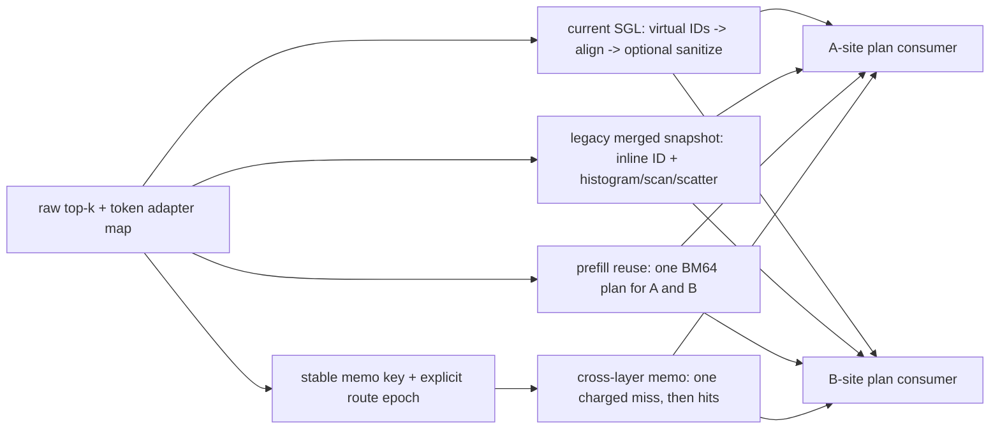

# SGL LoRA MoE route-plan counter-candidates

This bundle is a route-only decision record. Production dispatch is unchanged.
Every measured candidate consumes the same benchmark-owned `RoutePlan` contract
and the same synthetic delta consumer. Lower percentages are faster; `-10%`
means ten percent less device time than current SGL for that cell.

## What was measured

- Matrix: `T={1,32,256,2048}`, LoRA capacity `L={1,8}`, `(E,E_local)=(32,32)` and `(256,32)`, top-k 8, IID/skew/25%-base-row routes.
- O0 builds every route plan used by one layer and consumes both A/B plans.
- M0 is an actually executed 8-layer macro; every producer launch is charged. Cross-layer memo has one charged miss per macro.
- K0 is explicitly labeled prebuilt and contains only the common plan consumers.
- Eager and CUDA-graph timings use 15 counterbalanced samples after 3 warmups.
- `prefill_reuse` is a policy candidate only for T>=512; smaller rows are diagnostic counter-candidates.
- The legacy snapshot retains its inspected <=1024-bucket and single-adapter EP-compaction limits. It ran in 72/96 device/case cells; unsupported cells did not silently fall back.

## Devices and shards

| Label | GPU | Capability | Shard | Cases | Commit |
|---|---|---:|---:|---:|---:|
| gb300 | NVIDIA GB300 | [10, 3] | 0/1 | 48 | `4ffaee0b413f` |
| h200 | NVIDIA H200 | [9, 0] | 0/3 | 16 | `4ffaee0b413f` |
| h200 | NVIDIA H200 | [9, 0] | 1/3 | 16 | `4ffaee0b413f` |
| h200 | NVIDIA H200 | [9, 0] | 2/3 | 16 | `4ffaee0b413f` |

## Aggregate result

| Device | Mode | Candidate | Cells | median O0 delta | worst O0 delta | median M0 delta | projected 40L | projected 60L | projected 75L |
|---|---|---|---:|---:|---:|---:|---:|---:|---:|
| gb300 | cuda_graph | cross_layer_memo | 48 | -29.22% | -22.74% | -67.73% | -53.92% | -54.14% | -54.23% |
| gb300 | cuda_graph | current_sgl | 48 | 0.00% | 0.00% | 0.00% | 0.00% | 0.00% | 0.00% |
| gb300 | cuda_graph | legacy_merged | 36 | -17.27% | 19.18% | -24.38% | -17.27% | -17.27% | -17.27% |
| gb300 | cuda_graph | prefill_reuse | 48 | -29.16% | -22.45% | -35.39% | -29.16% | -29.16% | -29.16% |
| gb300 | eager | cross_layer_memo | 48 | -32.47% | -28.93% | -68.56% | -73.44% | -73.79% | -73.92% |
| gb300 | eager | current_sgl | 48 | 0.00% | 0.00% | 0.00% | 0.00% | 0.00% | 0.00% |
| gb300 | eager | legacy_merged | 36 | -36.22% | -28.33% | -39.21% | -36.22% | -36.22% | -36.22% |
| gb300 | eager | prefill_reuse | 48 | -32.01% | -27.24% | -34.80% | -32.01% | -32.01% | -32.01% |
| h200 | cuda_graph | cross_layer_memo | 48 | -28.37% | -22.51% | -67.94% | -49.75% | -49.93% | -50.00% |
| h200 | cuda_graph | current_sgl | 48 | 0.00% | 0.00% | 0.00% | 0.00% | 0.00% | 0.00% |
| h200 | cuda_graph | legacy_merged | 36 | -18.18% | 23.63% | -26.64% | -18.18% | -18.18% | -18.18% |
| h200 | cuda_graph | prefill_reuse | 48 | -27.95% | -20.86% | -35.11% | -27.95% | -27.95% | -27.95% |
| h200 | eager | cross_layer_memo | 48 | -33.78% | -30.25% | -69.56% | -71.88% | -72.22% | -72.36% |
| h200 | eager | current_sgl | 48 | 0.00% | 0.00% | 0.00% | 0.00% | 0.00% | 0.00% |
| h200 | eager | legacy_merged | 36 | -35.52% | -32.88% | -40.93% | -35.52% | -35.52% | -35.52% |
| h200 | eager | prefill_reuse | 48 | -34.38% | -30.80% | -36.24% | -34.38% | -34.38% | -34.38% |

The projection uses measured O0/K0 medians. Non-memo candidates repeat their
O0 cost per layer. Memo charges one O0 miss plus `(layers-1)*K0` hits. It is an
upper bound, not a production claim, because routed expert top-k normally
changes from layer to layer.

## Decision-oriented view

| Device | Mode | eligible prefill reuse median / worst O0 | reuse median M0 | legacy median / worst O0 | legacy regressions | memo projected 60L |
|---|---|---:|---:|---:|---:|---:|
| gb300 | eager | -31.02% / -29.51% | -34.57% | -36.22% / -28.33% | 0/36 | -73.79% |
| gb300 | cuda_graph | -35.02% / -29.95% | -40.48% | -17.27% / 19.18% | 6/36 | -54.14% |
| h200 | eager | -33.67% / -31.43% | -36.13% | -35.52% / -32.88% | 0/36 | -72.22% |
| h200 | cuda_graph | -35.50% / -29.81% | -41.47% | -18.18% / 23.63% | 9/36 | -49.93% |

- **Carry prefill route reuse forward as the default route-plan candidate.** In
  every eligible T=2048 route-only cell it reduced O0 device time on both GPUs;
  the table reports median and worst case so this is not a median-only claim.
  Full-pipeline tuning still decides whether BM64 is acceptable for the A GEMM.
- **Do not dispatch the legacy merged-align snapshot unconditionally.** It wins
  every supported eager cell, but graph replay exposes large-T regressions: its
  lower launch count no longer hides the less efficient fused histogram/scatter.
  It also cannot cover the inspected >1024-bucket/multi-adapter EP regime.
- **Keep cross-layer memoization contract-gated.** Its 40/60/75-layer savings
  are a valid stable-top-k ceiling, not a general per-expert MoE optimization.
  Shared-outer routes are the realistic first consumer because their plan can
  depend only on the stable token adapter mapping.

Largest observed legacy merged-align O0 regressions:

| Device | Mode | Case | Delta vs current |
|---|---|---|---:|
| h200 | cuda_graph | T2048_L8_E32_EL32_skew | 23.63% |
| h200 | cuda_graph | T2048_L1_E32_EL32_skew | 23.59% |
| h200 | cuda_graph | T2048_L8_E32_EL32_iid | 22.99% |
| h200 | cuda_graph | T2048_L1_E32_EL32_iid | 21.52% |
| gb300 | cuda_graph | T2048_L1_E32_EL32_skew | 19.18% |
| gb300 | cuda_graph | T2048_L8_E32_EL32_skew | 18.76% |
| gb300 | cuda_graph | T2048_L1_E32_EL32_iid | 17.94% |
| gb300 | cuda_graph | T2048_L8_E32_EL32_iid | 16.48% |
| h200 | cuda_graph | T2048_L1_E32_EL32_base_rows | 9.65% |
| gb300 | cuda_graph | T2048_L1_E32_EL32_base_rows | 5.74% |
| h200 | cuda_graph | T2048_L8_E32_EL32_base_rows | 4.42% |
| gb300 | cuda_graph | T2048_L8_E32_EL32_base_rows | 4.32% |

## Correctness and fairness guardrails

- Independent CPU routing reconstruction checks every valid pair exactly once,
  verifies its virtual expert, checks base/non-local rows contribute no delta,
  and compares the common consumer output bit-for-bit. All checks exact: **True**.
- H200 and GB300 use stable case-derived seeds, independent of shard layout.
- Candidate order rotates and reverses each round to counter cold/warm and drift bias.
- O0/M0 include virtual-ID, alignment, sanitation, zeroing, and consumer launches.
  K0 alone uses prebuilt metadata.
- Python memo-hit cost is reported separately because CUDA events do not see it;
  median by device: gb300: 367.4 ns, h200: 416.9 ns.
- The common consumer intentionally makes graph replay observable and equal, but
  this route-only test does not model how forcing BM64 changes downstream GEMM
  efficiency. Prefill reuse therefore still needs full-pipeline confirmation.

## Metadata lifetime and graph-refresh obligations

The memo key contains top-k and mapping pointers, tensor versions, shapes,
strides, device, expert/adapter capacities, EP window, block size, producer, and
an explicit caller-owned route epoch. The epoch is load-bearing: CUDA graph
input buffers retain a pointer while router kernels overwrite their contents,
which tensor identity/version alone cannot reliably detect.

Plans may live only within a forward or a graph epoch whose top-k contract is
stable. Invalidate after any router write, request-batch remap, adapter slot
load/eviction, capacity/rank/provider/layout change, EP-window/device change, or
graph recapture. Captured plan buffers and memo metadata must outlive the graph.
A replay must still execute its captured producer for new requests; caching a
plan across requests merely because graph pointers match is incorrect.

Per-expert MoE top-k normally differs across layers, so general cross-layer
memoization will miss safely. It is useful only when a caller contractually
reuses the same top-k (or for shared-outer routing that depends only on adapter
mapping). The projected 40/60/75-layer result is consequently the valid-hit
ceiling, while M0 demonstrates the charged execution mechanics.

## Reproduction and files

- `bench_route_countercandidates.py`: matrix generation, independent oracle,
  counterbalanced eager/graph timing, O0/M0/K0 semantics.
- `route_countercandidates.py`: provider-neutral plan interface, current SGL
  producer, explicit memo key, and common consumer.
- `route_countercandidate_merged_align.cu`: benchmark-owned snapshot of the
  inspected legacy fused merged-align kernel (SHA256 `e9e9ee56e0d7b828e4338f14498b898e34d8e56a9eae1378cd8306c67f984a5f`).
- `run_route_countercandidate_matrix.sh`: one deterministic shard per selected GPU.
- `per_case.csv` and `summary.json`: complete machine-readable results.
- `source_provenance.json`: byte-identical local/H200/GB300 source hashes.
- `SHA256SUMS`: integrity manifest for this bundle.
