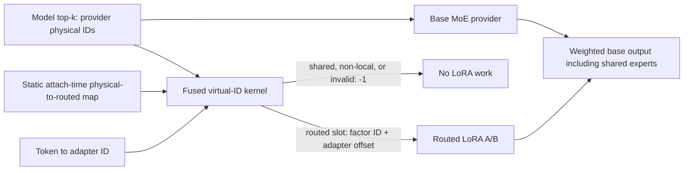

# SGL-LoRA model shared-expert phase

This bundle is the BF16 shared-expert graduation evidence for the new
SGL-LoRA MoE runner.  It covers conventional separate shared experts, a
side-stream overlap control, fused global physical slots, and the
DeepEP/MegaMOE-style per-rank interleaved physical-slot contract.  One- and
two-shared/sink-expert models are included.

The supported production outcome is intentionally narrow and safe:

- LoRA factors target routed experts only.  A model shared/sink slot always
  maps to `-1` before virtual-expert routing and can never alias the next
  adapter's routed factor.
- Non-contiguous physical IDs use one static attach-time lookup table consumed
  by the existing virtual-ID kernel.  There is no per-forward metadata build
  and no layout-conversion launch.
- Fused-shared configurations use the provider-neutral C0 runner.  Current
  C2/C3 consumers still assume the base physical expert domain equals the
  routed LoRA factor domain, so the planner must not select them here.
- The base provider decides whether shared experts are separate, globally
  appended, or interleaved per rank.  LoRA does not normalize the provider's
  physical weights into a second layout.

## Architecture



The map is keyed by the LoRA factor expert dimension because the memory pool
may retain global routed factors or only the current EP rank's routed factors.
Both forms are built once when required; the runner picks the matching map from
the actual factor tensor shape.

| Incoming provider layout | Physical order | Routed-factor map |
|:---|:---|:---|
| Global contiguous | all routed, then shared | Range check for global factors; explicit map is available for local factors |
| Local contiguous | local routed, then shared | Shared tail naturally falls outside the local factor domain |
| Global per-rank shared | rank0 routed, rank0 shared, rank1 routed, rank1 shared, ... | Explicit map removes every shared gap and optionally drops non-home ranks |

For two sink experts, each per-rank segment contains two physical shared slots;
the same map logic handles one, two, or more slots without a new kernel.

## Execution variants

| Variant | Shared-expert execution | Purpose |
|:---|:---|:---|
| `separate_serial` | Routed MoE+LoRA, then packed shared W13, fused SwiGLU/scale, packed shared W2 and add | Conventional correctness/performance control |
| `separate_overlap` | The same shared MLP on a side stream, joined before final add | Tests whether independent shared work is large enough to hide |
| `fused_global` | Shared slots appended once after all routed experts | Standard global fused provider layout |
| `fused_per_rank` | Shared slots interleaved after every rank's routed segment | DeepEP/MegaMOE ID-layout proxy with the new lookup map |

The separate two-sink W2 matrix is packed once at fixture construction.  No
weight permutation or descriptor build is charged to its timed forward.
Fused variants inverse-compensate shared top-k weights for the non-unit routed
scale (`1.7`), so base and oracle apply each model scale exactly once.

## Validation matrix

- Devices: NVIDIA H200 (SM90) and NVIDIA GB300 (SM103).
- Shapes: Qwen3.5-like `H=2048`, `I=512`, `E=256`, routed `K=8`.
- Phases/tokens: decode `T=1/32`; prefill `T=256/512`.
- Ranks: `32`, `64`, `128`.
- Adapter mixtures: one to four active adapters; active-only and mixed
  adapter/base rows; capacity up to eight.
- Shared forms: one conventional shared expert and two sink/shared slots.
- Execution: eager and CUDA-graph replay.
- Timing: 20 warmups and 100 CUDA-event samples.  Every CUDA-graph cell has a
  second reverse-order run to control ordering bias.
- Correctness: 144 full/repeat records plus 16 smoke records.  The independent
  oracle starts from logical routed/shared weights and IDs; it never consumes
  production physical IDs, route plans, or the physical-ID map.

All 144 full/repeat checks passed.  Minimum cosine similarity was
`0.99998337`; maximum absolute error was `3.05176e-05`; every record reports
`shared_slots_receive_lora=false`.  Final routing suites passed on both devices:
`20 passed, 5 skipped` (the skips are existing device-conditional controls).

## Performance conclusion

The detailed table is in `summary.md` and machine-readable values are in
`summary.json`.

- CUDA-graph decode: fused shared slots improve the serial control by
  `1.4–10.1%` across the tested ranks/devices.  The largest gain is `T=1`.
- CUDA-graph prefill: fused slots improve low/medium-rank cells by roughly
  `0.3–1.6%`; at `T=256, R=128, S=2` all four variants are effectively tied
  (within `0.35%`).
- Eager: fused variants are `2.5–20.8%` faster in most cells because they avoid
  the separate shared MLP's host launches.  Eager numbers are more sensitive
  to host contention and are not used alone for policy.
- Separate overlap is real but small.  Nsight shows 56–67% of the shorter
  stream hidden in representative decode/H200-prefill traces, yet the total
  pipeline generally does not beat fused slots.
- The per-rank lookup adds no launch.  Its full-pipeline delta versus globally
  contiguous fused slots is sub-percent in the repeated CUDA-graph matrix.

Physical layout is not a runtime autotune choice: it follows the selected base
provider.  The evidence says the mapped per-rank contract does not create a
material LoRA penalty and is preferable to repacking IDs or weights.

## Files

- `summary.md`, `summary.json`: complete latency/correctness comparison.
- `smoke_summary.md`, `smoke_summary.json`: tiny-shape graph/eager gate.
- `profiling_summary.md`: Nsight Systems overlap and Nsight Compute map-kernel
  interpretation.
- `HANDOFF.md`: concise tests, matrix counts, winner boundaries, trace names,
  and the mapped-C2/C3 gap.
- `raw/h200/`, `raw/gb300/`: raw JSON/logs, `.nsys-rep`, SQLite exports,
  analysis JSON, `.ncu-rep`, and readable NCU details.
- `manifest.tsv`: SHA256, byte size, and relative path for every evidence file.
- `MEASURED_SOURCE_SHA256SUMS`: hashes of the exact source, benchmark, and test
  files used for the GPU matrix.
- `SOURCE_SHA256SUMS`: hashes after integrating the lane with the preceding PDL
  and quant-provider commits. `MEASURED_SOURCE_SHA256SUMS` preserves the exact
  pre-integration source used for the full timing matrix; the merged source was
  revalidated on H200 and GB300.

## Reproduction

The benchmark driver is
`benchmark/kernels/lora_moe/bench_shared_experts.py`; the summarizer is
`benchmark/kernels/lora_moe/summarize_shared_experts.py`.

Example timing invocation:

```bash
CUDA_VISIBLE_DEVICES=0 PYTHONPATH=python \
python benchmark/kernels/lora_moe/bench_shared_experts.py \
  --case-id qwen35-decode-t32-r128-two-sink-mixed \
  --variant fused_per_rank --device h200 --execution cuda_graph \
  --warmup 20 --samples 100 --json-output result.json
```

Example correctness/routing suite:

```bash
CUDA_VISIBLE_DEVICES=0 PYTHONPATH=python pytest -q \
  test/registered/unit/lora/test_sgl_lora_shared_experts.py \
  test/registered/lora/test_sgl_lora_shared_expert_ids.py \
  test/registered/lora/test_virtual_experts_kernels.py
```

## Remaining shared-specific optimization

Extending C2/C3 requires their fused consumer/finalizer ABI to carry two
distinct domains: base physical expert identity (which includes shared slots)
and routed LoRA factor identity (which excludes them).  Reusing a raw top-k ID
for both is incorrect.  Until that mapped ABI is implemented and benchmarked,
the explicit C0 fallback is the complete supported behavior, not a silent
partial C2/C3 path.
